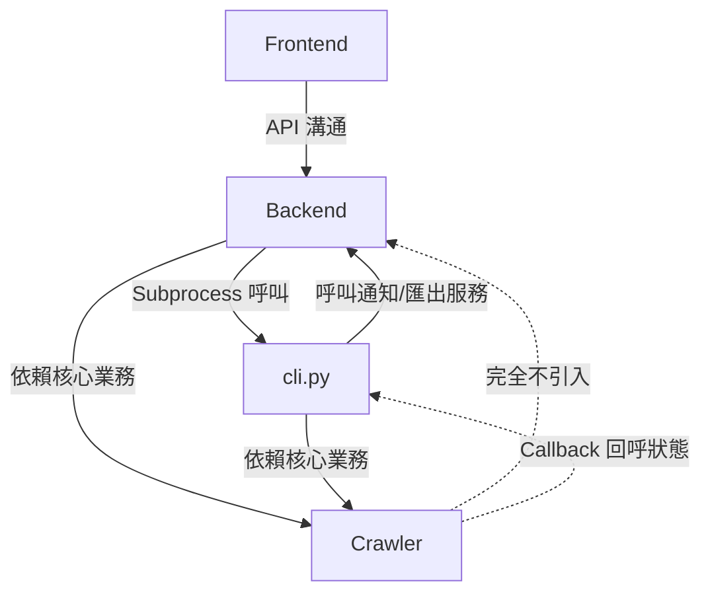

# 網站連結檢查系統 (Link Checker) 架構說明

本文件旨在概述系統的目錄結構與核心設計理念。專案目標為建立一個能夠遍歷特定網域，找出內部與外部連結並檢查其有效性與安全性的爬蟲系統。

## 專案目錄架構

```text
link-checker/
├── .env                # 環境變數設定檔 (如資料庫路徑、SMTP 憑證等)
├── .env.example        # 環境變數範例檔 (提供可用的設定項目參考)
├── .gitignore          # git 追蹤忽略清單
├── .pylintrc           # Pylint 靜態程式碼分析設定檔
├── ruff.toml           # Ruff 程式碼排版設定檔
├── README.md           # 專案首頁與安裝啟動說明
├── cli.py              # 系統核心單一入口 (CLI 操作、伺服器啟動與管理員建立)
├── requirements.txt    # Python 依賴套件清單
├── backend/            # 網站後台 (FastAPI / Web API Server)
│   ├── __init__.py
│   ├── admin/          # 後台管理員 API 模組
│   │   ├── __init__.py
│   │   └── router.py   # 管理員專用 API 路由
│   ├── auth/           # 身分驗證與 Session 管理模組
│   │   ├── __init__.py
│   │   ├── db.py       # Auth DB 連線與初始化
│   │   ├── models.py   # 使用者與 Session 資料庫模型
│   │   ├── password.py # 密碼雜湊與驗證工具
│   │   ├── router.py   # 登入、驗證與密碼管理 API 路由
│   │   └── service.py  # 身分驗證核心業務邏輯
│   ├── jobs/           # 任務管理與排程 API 模組
│   │   ├── constants.py# 任務設定鍵值共用常數
│   │   ├── router.py   # 任務模組總路由聚合器
│   │   ├── schemas.py  # 任務模組專用 Pydantic 與依賴注入 Model
│   │   ├── routers/    # 子 API 路由定義 (管理、結果、匯出)
│   │   └── services/   # 任務核心服務 (管理、進程、結果、郵件通知、報表匯出、局部重新探測)
│   ├── config.py       # 系統組態與環境變數設定
│   ├── deps.py         # 依賴注入 (如 Session, Current User)
│   ├── email_sender.py # SMTP 郵件發送服務
│   └── main.py         # FastAPI 應用程式進入點
├── frontend/           # 網站前台 UI (原生 Vanilla JS/CSS)
│   ├── css/            # Vanilla CSS 樣式表
│   ├── image/          # 靜態圖片與圖示資源
│   ├── js/             # Vanilla JS (ESM) 邏輯模組
│   │   ├── api.js, auth.js, auth-reset.js # API 與身分驗證
│   │   ├── jobs.js, job-detail.js         # 任務列表與詳情
│   │   ├── compare.js, duplicate.js       # 任務比對與複製
│   │   ├── transfer.js                    # 任務移交
│   │   └── toast.js                       # 全域通知元件 (Toast UI 封裝)
│   ├── index.html      # 登入與首頁
│   ├── app.html        # 爬蟲任務管理主介面
│   ├── admin.html      # 系統管理員後台介面
│   ├── faq.html        # 常見問答 (FAQ) 介面
│   ├── help.html       # 系統說明與教學介面
│   ├── forgot-password.html # 忘記密碼申請介面
│   ├── reset-password.html  # 重設密碼介面
│   └── set-password.html # 首次登入密碼設定介面
├── config/             # 存放全域設定檔 (config_global.yaml)
├── crawler/            # 爬蟲核心引擎 (高度自治模組)
│   ├── __init__.py
│   ├── config_utils.py # 組態防呆驗證與全域設定合併工具
│   ├── core.py         # 爬蟲核心邏輯 (抓取網頁、解析 HTML、提取與過濾連結)
│   ├── manager.py      # JOB 管理 (任務分派、資料持久化、防呆安全鎖，支援 Callback 狀態回呼)
│   ├── models.py       # Crawler DB 資料庫模型
│   ├── profiles.py     # 動態瀏覽器特徵 (Browser Profiles) 產生模組
│   ├── runner.py       # 爬蟲任務執行器 (包含狀態 Callback 回呼、狀態更新與併發處理)
│   └── utils.py        # 工具程式 (IP 解析、網域比對邏輯)
├── db/                 # 存放 SQLite 本地資料庫 (crawler.db, auth.db)
├── doc/                # 系統架構、Schema 與需求規格說明文件
│   ├── api.json, api_routes.md, api_spec.md # API 規格與路由清單
│   ├── architecture.md       # 系統架構說明 (本文件)
│   ├── cli_usage.md          # 命令列 (CLI) 操作指南
│   ├── crawler_parameters.md # 爬蟲參數詳細說明
│   ├── db_schema.md          # 資料庫 Schema 說明
│   ├── deploy_gcp_vm.md      # GCP 雲端部署指南
│   ├── js_coding_style.md    # JavaScript 程式風格與開發規範
│   ├── migrate_to_postgresql.md # PostgreSQL 遷移指南
│   ├── module_dependencies.md# 模組間詳細依賴說明
│   ├── python_coding_style.md# Python 程式風格與開發規範
│   ├── requirements.md       # 系統需求規格書
│   ├── testing_strategy.md   # 自動化測試策略與執行指南
│   └── todo.md               # 待辦清單與優化計畫
├── job/                # 存放個別任務 YAML 設定檔的安全目錄
├── log/                # 存放系統日誌與進程狀態
│   ├── pids/           # 存放運行中爬蟲子程序的 PID 檔案
│   └── crawler.log     # 系統主日誌檔
├── report/             # 外部連結分析與內部網頁診斷報告之預設匯出目錄
├── scripts/            # 系統維運與自動化腳本
│   ├── backfill_status_category.py # 補填舊任務 status_category 欄位腳本
│   ├── backfill_target_domain.py # 補填舊任務 target_domains 腳本
│   ├── check_db_schema.py      # DB Schema 檢查腳本
│   ├── gen_api_doc.py          # 自動產生 API 規格與路由清單
│   ├── job_sync.sh             # 跨環境任務備份與還原工具便利包
│   ├── manage_job_data.py      # 任務資料跨庫 JSONL 匯出匯入核心 (含外連與內連狀態)
│   ├── migrate_sqlite_to_pg.py # PostgreSQL 平滑升級全自動遷移腳本
│   ├── run_all_tests.sh        # 全域自動化測試套件啟動腳本
│   ├── test_ext.py             # 單一外部連結存活測試腳本
│   └── test_url.py             # 單一頁面爬取測試腳本
├── test/               # 一鍵式自動化整合測試套件 (基於 Pytest)
│   ├── conftest.py     # 模組級隔離與全域 Fixture
│   ├── utils.py        # 測試輔助工具 (Port 與 Server 監控)
│   ├── test_api.py     # API 端點與 Web 後台整合測試
│   ├── test_cli.py     # CLI 爬蟲核心與調度整合測試
│   ├── test_admin_logs.py # 後台安全稽核日誌整合測試
│   ├── test_scheduler.py  # 任務排程器自動化測試
│   ├── test_server/    # 本機 Mock HTTP 測試伺服器靶機
│   └── e2e/            # Playwright 前端介面自動化測試
│       ├── conftest.py
│       ├── test_admin.py
│       ├── test_app.py
│       ├── test_auth.py
│       └── test_duplicate.py
└── tmp/                # 暫存檔與備份目錄
```

## 系統分層架構 (System Layering)

本專案依循高內聚、低耦合的架構原則，並落實 **CLI-First** 的獨立運作能力。

### 模組依賴關係圖

本專案各模組（Frontend, Backend, Crawler 與 CLI）以儘可能解耦為目標，其依賴關係如下：



### 核心設計層級

本系統整體架構分為以下四個核心層級：

1. **前端展示層 (Frontend Layer)**
   * 原生 Vanilla JS (ESM) 與 Vanilla CSS，不依賴任何前端框架，確保極低的維護成本與供應鏈安全。
   * 採用 Single Page Application (SPA) 架構，所有狀態更新皆透過 REST API 與 Server-Sent Events (SSE) 即時通訊獲取，並具備前端路由解析能力。

2. **Web 服務層 (API & Application Layer)**
   * 採用 FastAPI 框架提供非同步的 HTTP 服務，負責處理路由、身分驗證 (Auth/Session)、CSRF 防禦、全域配置管理與請求校驗。
   * **進程隔離 (Subprocess Bridge)**：Web 服務不直接在主記憶體內執行爬蟲，而是負責生成 (Spawn) 獨立的子程序呼叫 Crawler 引擎，藉此保護 API 主事件迴圈不被阻塞。

3. **爬蟲核心引擎 (Crawler Core)**
   * CLI (`cli.py`) 直接驅動，能在沒有 Web 伺服器的情況下獨立完成所有工作。
   * 結合 `httpx` 與 `BeautifulSoup4`，負責網路探測、HTML 解析、防護機制穿透 (Anti-Bot Bypass) 與錯誤重試。
   * 全程由資料庫狀態 (State-driven) 引導執行，具備中斷恢復、協同暫停與殭屍進程防禦等高可靠度機制。

4. **資料持久層 (Data Layer)**
   * 採用雙資料庫實體分離架構：**Auth DB** (掌管帳號、日誌與權限) 與 **Crawler DB** (掌管任務、佇列與外連結果)。
   * 透過 SQLAlchemy ORM 抽象化，支援從輕量級 SQLite 無縫擴展至企業級 PostgreSQL。

> 💡 **詳細的技術規範與實作機制：** 關於爬蟲廣度優先策略、OOM 保護、Anti-Bot 穿透、Session 機制、OOM 巨量串流匯出等詳細功能要求與開發規範，請參閱 **系統需求規格書 (requirements.md)**。

## 相關參考文件

為了保持文件聚焦，各模組之詳細設計已拆分至以下獨立文件：
* [系統需求規格書](requirements.md)：所有業務邏輯、資安防護與容錯機制之最高指導原則。
* [模組間詳細依賴說明文件](module_dependencies.md)
* [命令列 (CLI) 操作指南](cli_usage.md)
* [API 規格與路由清單](api_routes.md) 及 [API 詳細規格](api_spec.md)
* [爬蟲參數詳細說明](crawler_parameters.md)
* [資料庫 Schema 說明](db_schema.md)
* [GCP 雲端部署指南](deploy_gcp_vm.md)
* [PostgreSQL 遷移指南](migrate_to_postgresql.md)
* [自動化測試策略與執行指南](testing_strategy.md)
* [Python 程式風格規範](python_coding_style.md)
* [JavaScript 程式風格規範](js_coding_style.md)
* [待辦清單與後續優化計畫](todo.md)
