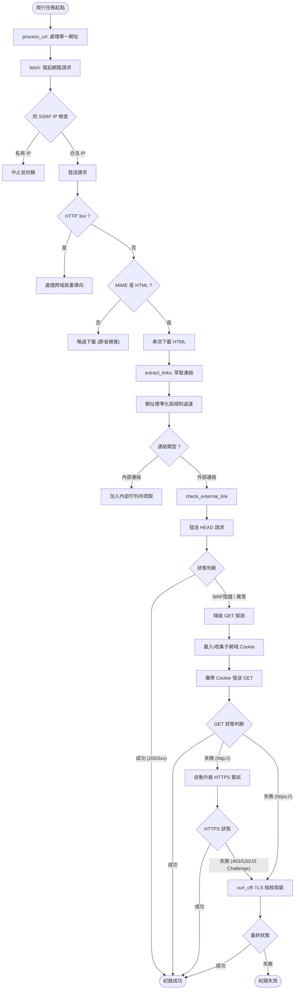

# 網站爬蟲核心流程說明 (Crawler Workflow)

本文件依據 `crawler/core.py` 的實作，詳細說明網站連結檢查系統的爬蟲核心架構與執行流程。爬蟲核心 (`CrawlerCore`) 主要職責分為兩大主軸：**內部網頁爬取與連結解析**（深度探索），以及**外部連結存活探測**（廣度探測與資安容錯）。

---

## 核心流程總覽 (Flowchart)

---

## 1. 初始化與組態 (Initialization)

爬蟲啟動時，會透過 `__init__` 初始化以下關鍵元件：
- **正規表達式預先編譯** (`_compile_regexes`)：載入並編譯 `ignore_paths` 等忽略規則，提升後續比對效能。
- **雙 HTTPX Client 引擎**：
  - `self.client`：預設的 HTTPX 請求引擎，執行嚴格的 SSL/TLS 憑證鏈校驗。
  - `self.exempt_client`：豁免 SSL 驗證的 HTTPX 引擎，專供 `ssl_exempt_domains` 白名單中的網域使用。
  - 這兩個 Client 皆設定為不自動跟隨重導向 (`follow_redirects=False`)，將所有重導向交由程式邏輯手動控制，以防堵跨域重導向等資安問題。

---

## 2. 內部網頁爬取流程 (Internal Fetching)

內部爬取主要針對屬於 `target_domains` 的網址，目的是取得 HTML 原始碼以供解析連結。

### 2.1 請求與重試 (Fetch & Retry)
- **`process_url`**：對外的主要介面，依序呼叫 `fetch` 取得網頁內容，再呼叫 `extract_links` 萃取連結。
- **`fetch`**：實作了包含「隨機抖動 (Jitter)」的指數退避重試機制 (Exponential Backoff)。若遭遇暫時性網路錯誤（如 502, 503, 504），會自動休眠後重試。
- **`_fetch_single`**：單次執行的網路請求入口。

### 2.2 連線與資安檢測
- **`_get_client`**：依據目標網址是否符合 `ssl_exempt_domains` 子網域繼承規則，決定使用 `self.client` 或 `self.exempt_client` 發起請求。
- **`_resolve_and_check_ssrf`**：在正式發出請求前或收到重導向時，解析目標主機 IP。若 IP 屬於私有網段（如 `127.0.0.1`、`192.168.x.x`）則直接封鎖，防止 SSRF (Server-Side Request Forgery) 攻擊。

### 2.3 回應處理與串流下載
- **`_process_response`**：統整 HTTP 回應的各項檢查。
- **`_handle_redirect`**：攔截 `3xx` 狀態碼，判斷 `Location` 的目標是否跨出了目標網域。若發生跨域重導向，會回傳特殊狀態碼告知上層中止抓取，將其轉為外部探測邏輯。
- **`_check_mime_type`**：基於 `Content-Type` 標頭判斷檔案類型。若非 HTML 文件（如 PDF、ZIP），則直接略過內容下載以節省頻寬。
- **`_download_content`**：使用 HTTP 串流 (`stream`) 分段下載內容，若發現下載的檔案超出設定的 `max_file_size` 時，即刻中斷連線避免 OOM (Out of Memory)。

---

## 3. 連結萃取與過濾 (Link Extraction)

成功抓取 HTML 文件後，交由解析模組提煉出網頁內所有的資源參考點。

- **`extract_links`**：透過 BeautifulSoup4 解析 DOM 樹。
- **`_extract_base_url`**：優先尋找網頁中是否有 `<base href="...">` 宣告，若有則覆寫相對路徑的基準 URL。
- **`_collect_raw_links`**：走訪並蒐集所有常見的資源屬性，包含 `<a href>`, ``, `<link href>`, `<script src>` 以及 `<iframe>` 與 `<video>` 等。
- **`_normalize_and_filter_link`**：
  - 剔除無效的偽協定，例如 `javascript:`、`mailto:`、`tel:`。
  - 將 URL 尾端的錨點（Fragment `#`）剝除。
  - 將相對路徑拼接為完整的絕對路徑。
- **`_check_ignore_rules`**：檢查標準化後的網址是否符合排除規則，包含附檔名排除（如 `.pdf`、`.jpg`）以及自訂的正則表達式排除清單。

---

## 4. 外部連結探測流程 (External Link Checking)

對於不在 `target_domains` 內的站外連結，系統僅需確認其「是否存活（HTTP 200/3xx）」，不下載其內容。這部分實作了高度的容錯與反反爬蟲 (Anti-Anti-Bot) 策略。

### 4.1 核心探測進入點
- **`check_external_link`**：為探測流程的進入點，此處會建立一個專屬的 `accumulated_cookies` 容器，以隔離記錄單次探測中跨跳的 Cookie。
- **`_check_external_single`**：包裹著單次探測的例外處理，專門攔截因網頁撰寫失誤導致的畸形網址（例如 `UnicodeError` 造成的 DNS 解析崩潰），並轉化為安全的 `failed` 標記。

### 4.2 探測策略與 Cookie 穿透
- **`_execute_external_request`**：預設採用 `HEAD` 請求。若發送 `HEAD` 遭到伺服器退回（例如收到特定 WAF 阻擋代碼：400, 403, 405, 406），或收到重導向（3xx），系統會主動呼叫 `_fallback_get` 進行二次確認。
- **`_fallback_get`**（GET 降級探測）：
  - 捨棄現代瀏覽器的高階資安特徵（如 `Sec-Fetch-Site` 等標頭），改以最單純的 `GET` 發送。
  - **Cookie-gate 穿透**：在此降級與重導向跟隨的過程中，會將伺服器透過 `Set-Cookie` 指定的 Cookie 依據 `domain` 參數收集至 `accumulated_cookies` 中。
- **`_get_applicable_cookies`**：發送請求前，依據目標子網域動態計算應該挾帶哪些 Cookie。支援「萬用字元子網域繼承」（如 `acs.domain.com` 繼承 `.domain.com`），確保能夠完美穿透 Citrix NetScaler 等前端 Cookie-gate 驗證。

### 4.3 終極降級與容錯重試 (Fallbacks)
若單純的 `_fallback_get` 仍無法順利取得存活證明，系統將啟動最後防線：
- **自動 HTTPS 升級 (`_handle_http_failure_retry`)**：若原始網址為明文 `http://` 且連線失敗（或遭回傳大於等於 400 的異常碼），系統將強制將協定升級為 `https://` 進行二次重試，以突破現代網站強制實施的 HSTS 政策或嚴格 WAF 規則。
- **雙引擎 TLS 指紋偽裝 (`_tls_spoofed_fallback`)**：若標頭剝離與 HTTPS 升級皆無法穿透 Cloudflare 或其他企業級高階防火牆（如持續收到 403 / 520 / JS Challenge 攔截），系統會動用基於 `curl_cffi` 的後備引擎。該引擎可產生 100% 吻合 Chrome 等現代瀏覽器的 TLS 指紋（包含 JA3 特徵與 HTTP/2 握手行為），藉此消弭絕大多數的假死連結誤報。

---

## 5. 資源清理
- **`close`**：爬蟲任務結束後，主動關閉底層的 HTTPX 連線池與釋放所有客戶端資源，確保系統能長時間穩定運作，避免發生連線資源洩漏。
