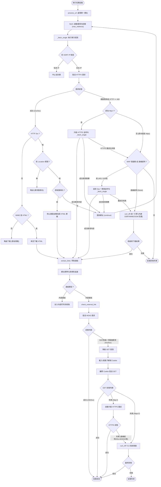

# 網站爬蟲核心流程說明 (Crawler Workflow)

本文件依據 `crawler/core.py` 的實作，詳細說明網站連結檢查系統的爬蟲核心架構與執行流程。爬蟲核心 (`CrawlerCore`) 主要職責分為兩大主軸：**內部網頁爬取與連結解析**（深度探索），以及**外部連結存活探測**（廣度探測與資安容錯）。

---

## 核心流程總覽 (Flowchart)

---

## 1. 初始化與組態 (Initialization)

爬蟲啟動時，會透過 `__init__` 初始化以下關鍵元件：
- **正規表達式預先編譯** (`_compile_regexes`)：載入並編譯 `ignore_paths` 等忽略規則，提升後續比對效能。
- **雙 HTTPX Client 引擎**：
  - `self.client`：預設的 HTTPX 請求引擎，執行嚴格的 SSL/TLS 憑證鏈校驗。
  - `self.exempt_client`：豁免 SSL 驗證的 HTTPX 引擎，專供 `ssl_exempt_domains` 白名單中的網域使用。
  - 這兩個 Client 皆設定為不自動跟隨重導向 (`follow_redirects=False`)，將所有重導向交由程式邏輯手動控制，以防堵跨域重導向等資安問題。

---

## 2. 內部網頁爬取流程 (Internal Fetching)

內部爬取主要針對屬於 `target_domains` 的網址，目的是取得 HTML 原始碼以供解析連結。

### 2.1 請求與重試 (Fetch & Retry)
- **`process_url`**：對外的主要介面，依序呼叫 `fetch` 取得網頁內容，再呼叫 `extract_links` 萃取連結。
- **`fetch`**：實作了包含「隨機抖動 (Jitter)」的指數退避重試機制，並封裝了強大的多階層異常容錯與防護穿透邏輯，攔截所有例外（不向外拋出）：
  1. **HTTP 自動升級**：若以 `http://` 請求時遭遇連線錯誤或 HTTP >= 400，會自動替換為 `https://` 進行重試。
  2. **特徵標頭拔除**：若遭遇常見 WAF 阻擋碼（如 403, 520 等），將嘗試拔除 `Sec-CH-UA` 等現代瀏覽器特徵標頭後重試。
  3. **終極 TLS 偽裝 (`_execute_curl_cffi_fallback`)**：若拔除標頭仍受阻，或一開始就遭遇連線超時/丟棄 (狀態碼為 None) 等 stealthy Tarpit 阻擋，自動降級呼叫 `curl_cffi` 引擎。此引擎為內部與外部共用的統一入口，內建 SSRF 攔截、MIME Type 檢查，以及 `iter_content` 的記憶體分塊下載與容量上限保護防 OOM。
  4. **統一例外處理**：除了網路層錯誤，也以全域 `Exception` 攔截如 `ValueError` 等底層異常，統一回傳 `failed` 狀態。
- **`_fetch_single`**：單次執行的網路請求入口，包含實際呼叫 HTTPX。

### 2.2 連線與資安檢測
- **`_get_client`**：依據目標網址是否符合 `ssl_exempt_domains` 子網域繼承規則，決定使用 `self.client` 或 `self.exempt_client` 發起請求。
- **`_resolve_and_check_ssrf`**：在正式發出請求前或收到重導向時，解析目標主機 IP。若 IP 屬於私有網段（如 `127.0.0.1`、`192.168.x.x`）則直接封鎖，防止 SSRF (Server-Side Request Forgery) 攻擊。

### 2.3 手動重導向與跨域攔截 (Manual Redirect Handling)
為了嚴格控制爬取範圍與防範安全性問題，爬蟲核心關閉了 HTTP 客戶端的自動重導向機制 (`follow_redirects=False`)，並在 `_handle_redirect` 中實作手動的 3xx 攔截處理流程：
- **檢查 Location 標頭**：若回應為 3xx 但缺少 Location，則標記為異常並略過。
- **內部重導向追蹤**：若新的目標網址仍屬於 `target_domains`，則扣減剩餘重導向次數並繼續跟隨追蹤。
- **跨域外流攔截**：若新的目標網址跨出了指定的目標網域（例如被轉址到了外部廣告或社群網站），爬蟲會**立即停止深入抓取**以節省運算資源，並在記憶體中動態生成一段包含該外部網址的**「假 HTML 標籤」** (``)，交由後續的解析模組當作一般的外部連結來接手處理與探測。

### 2.4 回應處理與串流下載
- **`_process_response`**：統整 HTTP 回應的各項檢查。
- **`_check_mime_type`**：基於 `Content-Type` 標頭判斷檔案類型。若非 HTML 文件（如 PDF、ZIP），則直接略過內容下載以節省頻寬。
- **`_download_content`**：使用 HTTP 串流 (`stream`) 分段下載內容，若發現下載的檔案超出設定的 `max_file_size` 時，即刻中斷連線避免 OOM (Out of Memory)。

---

## 3. 連結萃取與過濾 (Link Extraction)

成功抓取 HTML 文件後，交由解析模組提煉出網頁內所有的資源參考點。

- **`extract_links`**：透過 BeautifulSoup4 解析 DOM 樹。
- **`_extract_base_url`**：優先尋找網頁中是否有 `<base href="...">` 宣告，若有則覆寫相對路徑的基準 URL。
- **`_collect_raw_links`**：走訪並蒐集所有常見的資源屬性，包含 `<a href>`, ``, `<link href>`, `<script src>` 以及 `<iframe>` 與 `<video>` 等。
- **`_normalize_and_filter_link`**：
  - 剔除無效的偽協定，例如 `javascript:`、`mailto:`、`tel:`。
  - 將 URL 尾端的錨點（Fragment `#`）剝除。
  - 將相對路徑拼接為完整的絕對路徑。
- **`_check_ignore_rules`**：檢查標準化後的網址是否符合排除規則，包含附檔名排除（如 `.pdf`、`.jpg`）以及自訂的正則表達式排除清單。

---

## 4. 外部連結探測流程 (External Link Checking)

對於不在 `target_domains` 內的站外連結，系統僅需確認其「是否存活（HTTP 200/3xx）」，不下載其內容。這部分實作了高度的容錯與反反爬蟲 (Anti-Anti-Bot) 策略。

### 4.1 核心探測進入點
- **`check_external_link`**：為探測流程的進入點，此處會建立一個專屬的 `accumulated_cookies` 容器，以隔離記錄單次探測中跨跳的 Cookie。
- **`_check_external_single`**：包裹著單次探測的例外處理，專門攔截因網頁撰寫失誤導致的畸形網址（例如 `UnicodeError` 造成的 DNS 解析崩潰），並轉化為安全的 `failed` 標記。

### 4.2 探測策略與 Cookie 穿透
- **`_execute_external_request`**：預設採用 `HEAD` 請求。若發送 `HEAD` 遭到伺服器退回（收到常見 WAF 阻擋代碼 400, 403, 405, 406，或是伺服器無法正確處理 HEAD 而拋出 500, 502, 503, 504），或是收到重導向（3xx），系統會主動呼叫 `_fallback_get` 進行二次確認。
- **`_fallback_get`**（GET 降級探測）：
  - 捨棄現代瀏覽器的高階資安特徵（如 `Sec-Fetch-Site` 等標頭），改以最單純的 `GET` 發送。
  - **Cookie-gate 穿透**：在此降級與重導向跟隨的過程中，會將伺服器透過 `Set-Cookie` 指定的 Cookie 收集至 `accumulated_cookies` 中。若伺服器回傳 Cookie 時未顯式帶有 `Domain` 屬性，系統將會自動使其繼承當前的目標網域 (`tgt_dom`)，避免合法 Session 遭到誤棄。
- **`_get_applicable_cookies`**：發送請求前，依據目標子網域動態計算應該挾帶哪些 Cookie。支援「萬用字元子網域繼承」（如 `acs.domain.com` 繼承 `.domain.com`），確保能夠完美穿透 Citrix NetScaler 等前端 Cookie-gate 驗證。

### 4.3 終極降級與容錯重試 (Fallbacks)
若單純的 `_fallback_get` 仍無法順利取得存活證明，系統將啟動最後防線：
- **自動 HTTPS 升級 (`_handle_http_failure_retry`)**：若原始網址為明文 `http://` 且連線失敗（或遭回傳大於等於 400 的異常碼），系統將強制將協定升級為 `https://` 進行二次重試。此方法會精準比對重試結果，透過 `fell_back` 旗標區分「真的連不上」與「受到 WAF 阻擋」。特別是當 HTTPS 重試遭遇 SSL/TLS 層級錯誤時，系統不會退回原本 HTTP 的錯誤來掩蓋真相，因這類異常極可能是 WAF 針對 TLS Handshake 指紋的封鎖（而非單純憑證不信任），系統會回報該 SSL 錯誤並允許進入後續的 TLS 偽裝階段，利用高擬真 Chrome 指紋嘗試穿透。
- **統一 TLS 指紋偽裝引擎 (`_execute_curl_cffi_fallback`)**：若標頭剝離與 HTTPS 升級皆無法穿透 Cloudflare 或其他企業級高階防火牆（如持續收到 403 / 520 攔截，或遭遇 stealthy Tarpit 導致連線超時/狀態碼為 None 時），系統會動用基於 `curl_cffi` 的統一備援引擎。外部探測模式 (`is_internal=False`) 下只會驗證狀態碼，不下載內容，藉此消弭絕大多數的假死連結誤報。

---

## 5. 資源清理
- **`close`**：爬蟲任務結束後，主動關閉底層的 HTTPX 連線池與釋放所有客戶端資源，確保系統能長時間穩定運作，避免發生連線資源洩漏。
