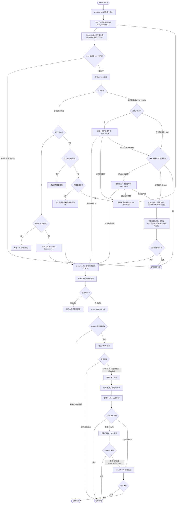

# 網站爬蟲核心流程說明 (Crawler Workflow)

本文件依據 `crawler/core.py` 的實作，詳細說明網站連結檢查系統的爬蟲核心架構與執行流程。爬蟲核心 (`CrawlerCore`) 主要職責分為兩大主軸：**內部網頁爬取與連結解析**（深度探索），以及**外部連結存活探測**（廣度探測與資安容錯）。

---

## 核心流程總覽 (Flowchart)

---

## 1. 初始化與組態 (Initialization)

爬蟲啟動時，會透過 `__init__` 初始化以下關鍵元件：
- **正規表達式預先編譯** (`_compile_regexes`)：載入並編譯 `ignore_paths` 等忽略規則，提升後續比對效能。
- **雙 HTTPX Client 引擎**：
  - `self.client`：預設的 HTTPX 請求引擎，執行嚴格的 SSL/TLS 憑證鏈校驗。
  - `self.exempt_client`：豁免 SSL 驗證的 HTTPX 引擎，專供 `ssl_exempt_domains` 白名單中的網域使用。
  - 這兩個 Client 皆設定為不自動跟隨重導向 (`follow_redirects=False`)，將所有重導向交由程式邏輯手動控制，以防堵跨域重導向等資安問題。
- **Context Manager 支援**：支援以 `with CrawlerCore(config) as crawler:` 的方式啟動，確保離開範圍時會自動呼叫 `close()` 釋放連線池資源。

---

## 2. 內部網頁爬取流程 (Internal Fetching)

內部爬取主要針對屬於 `target_domains` 的網址，目的是取得 HTML 原始碼以供解析連結。

### 2.1 請求與重試 (Fetch & Retry)
- **`process_url`**：對外的主要介面，依序呼叫 `fetch` 取得網頁內容，再呼叫 `extract_links` 萃取連結。
- **`fetch`**：實作了包含「隨機抖動 (Jitter)」的指數退避重試機制，以及確保最高跳轉次數一致的 `range(max_redirects + 1)` 迴圈。封裝了強大的多階層異常容錯與防護穿透邏輯，並確保**絕不向外拋出例外**：
  1. **HTTP 自動升級**：若以 `http://` 請求時遭遇連線錯誤或 HTTP >= 400，會自動替換為 `https://` 進行重試。
  2. **特徵標頭拔除**：若遭遇常見 WAF 阻擋碼（如 403, 520 等），將嘗試拔除 `Sec-CH-UA` 等現代瀏覽器特徵標頭後重試。
  3. **終極 TLS 偽裝 (`_execute_curl_cffi_fallback`)**：若拔除標頭仍受阻，或遭遇連線超時/丟棄 (狀態碼為 None) 等 stealthy Tarpit 阻擋，自動降級呼叫 `curl_cffi` 引擎。**此階段將捨棄不完整的 HTTP 跳轉狀態，改從最原始的 `url` 重新發起連線**，由備援引擎自行跑完重導向與 Cookie 收集。
  4. **全方位例外攔截**：定義 `_FETCH_SAFE_EXCEPTIONS` 以攔截已知的網路或解碼例外，更在主流程最外層利用 `Exception` 攔截所有未知錯誤，統一轉化為安全的 `failed` 狀態以避免中斷整個爬行任務。
- **`_fetch_single`**：單次執行的網路請求入口，包含實際呼叫 HTTPX。現在支援接收 `accumulated_cookies` 以維持跨跳轉的連線狀態。

### 2.2 連線與資安檢測
- **`_get_client`**：依據目標網址是否符合 `ssl_exempt_domains` 子網域繼承規則，決定使用 `self.client` 或 `self.exempt_client` 發起請求。
- **`_resolve_and_check_ssrf`**：在正式發出請求前，統一進行底層網路檢測：
  1. **提早攔截死連結**：若目標網域無法解析 IP (`resolve_ip` 回傳 None)，直接中斷內部抓取與外部探測，並標記為 `failed`。
  2. **防範 SSRF 攻擊**：解析出的 IP 若屬於私有網段（如 `127.0.0.1`）則直接封鎖。

### 2.3 手動重導向與跨域攔截 (Manual Redirect Handling)
為嚴格控制爬取範圍與防範安全性問題，爬蟲核心關閉了自動重導向機制 (`follow_redirects=False`)，並在 `_handle_redirect` 中實作手動的 3xx 攔截處理流程：
- **檢查 Location 標頭**：若回應為 3xx 但缺少 Location，則標記為異常並略過。
- **內部 Cookie-gate 穿透與重導向追蹤**：對於內部的同域跳轉，`fetch()` 如今會收集伺服器的 `Set-Cookie` 並傳遞給下一次跳轉 (`accumulated_cookies`)。這使得爬蟲也能順暢通過需要 SSO 或 Cookie-gate 保護的企業內部網站。
- **跨域外流攔截**：若新的目標網址跨出了指定的目標網域，爬蟲會**立即停止深入抓取**，並直接回傳包含該外部網址的**「網址清單」** (`[next_url]`)，交由後續的解析模組當作一般的外部連結來接手處理，免除無謂的字串生成與解析。

### 2.4 回應處理與串流下載
- **`_process_response`**：統整 HTTP 回應的各項檢查。
- **`_check_mime_type`**：基於 `Content-Type` 標頭判斷檔案類型。若非 HTML 文件（如 PDF），則直接略過下載。
- **`_download_content`**：使用 HTTP 串流 (`stream`) 分段下載內容，包含檔案大小保護 (防 OOM)，並且使用 `_safe_decode` 以避免遇到不合法或未知的 `charset` (例如 `charset=xxx-unknown`) 時引發 `LookupError` 崩潰。
  - 附帶一提，內部網路請求同樣採用手動將 Cookie 寫入 `headers["Cookie"]` 的方式，避免 `httpx` 已廢棄 `cookies=` 參數的不穩定行為。

---

## 3. 連結萃取與過濾 (Link Extraction)

成功抓取 HTML 文件後，交由解析模組提煉出網頁內所有的資源參考點。

- **`extract_links`**：透過 BeautifulSoup4 解析 DOM 樹，並以 `dict.fromkeys()` 的方式過濾重複的連結。此做法確保能夠精準保留連結在 HTML 中出現的原始順序，有利於除錯與測試的一致性。
- **`_extract_base_url`**：優先尋找網頁中是否有 `<base href="...">` 宣告，若有則覆寫相對路徑的基準 URL。
- **`_collect_raw_links`**：走訪並蒐集所有常見的資源屬性 (`<a>`, ``, `<script>` 等)，同時支援從 `<meta http-equiv="refresh">` 標籤中解析前端自動跳轉 (Client-side Redirect) 網址。
- **`_normalize_and_filter_link`**：
  - 剔除無效的偽協定 (`javascript:`, `mailto:` 等)。
  - 將 URL 尾端的錨點（Fragment `#`）剝除。
  - 將相對路徑拼接為完整的絕對路徑。
- **`_check_ignore_rules`**：檢查標準化後的網址是否符合附檔名或正則表達式排除規則。

---

## 4. 外部連結探測流程 (External Link Checking)

對於不在 `target_domains` 內的站外連結，系統僅需確認其「是否存活（HTTP 200/3xx）」，不下載其內容。實作了高度的容錯與反反爬蟲 (Anti-Anti-Bot) 策略。

### 4.1 核心探測進入點
- **`check_external_link`**：探測流程的進入點，建立專屬的 `accumulated_cookies` 容器，以隔離記錄單次探測中跨跳的 Cookie。
- **`_check_external_single`**：包裹著單次探測的例外處理與前置檢查：
  - 專門攔截因網頁撰寫失誤導致的畸形網址（例如 `UnicodeError` 造成的 DNS 解析崩潰），並轉化為安全的 `failed` 標記。
  - **提早攔截死連結與 SSRF 防護**：發送 HTTP 請求前先進行 DNS 解析 (`resolve_ip`)。如果解析失敗會直接中斷探測。配合 `lru_cache` 快取機制，大量死連結不會拖垮系統效能。

### 4.2 探測策略與 Cookie 穿透
- **`_execute_external_request`**：預設採用 `HEAD` 請求。若發送 `HEAD` 遭到退回（400, 403, 405, 500 等）或重導向，會主動呼叫 `_fallback_get` 進行二次確認。
- **`_fallback_get`**（GET 降級探測）：
  - 捨棄現代瀏覽器的資安特徵（如 `Sec-Fetch-Site`），改以 `GET` 發送。
  - **Cookie-gate 穿透**：將伺服器透過 `Set-Cookie` 指定的 Cookie 收集至 `accumulated_cookies` 中。支援萬用字元子網域繼承，完美穿透 Citrix NetScaler 等 Cookie-gate 驗證。為避免 `httpx` 已廢棄的 `cookies=` 參數產生不確定行為，一律採用手動組裝並寫入 `headers["Cookie"]` 傳遞。
- **`_get_applicable_cookies`**：依據目標子網域動態計算應該挾帶的 Cookie。

### 4.3 終極降級與容錯重試 (Fallbacks)
若單純的 `_fallback_get` 仍無法順利取得存活證明，系統將啟動最後防線：
- **自動 HTTPS 升級 (`_handle_http_failure_retry`)**：若 `http://` 連線失敗，強制升級為 `https://` 進行二次重試。當 HTTPS 重試遭遇 SSL/TLS 錯誤時，系統會記錄該異常並允許進入後續的 TLS 偽裝階段。
- **統一 TLS 指紋偽裝引擎 (`_execute_curl_cffi_fallback`)**：若前述降級皆無法穿透 Cloudflare 或企業防護牆，動用基於 `curl_cffi` 的統一備援引擎。
  - **全盤從頭與 Cookie 隔離**：為了保持乾淨的狀態，TLS 偽裝引擎**不會接續 `httpx` 卡住的網址，而是重新從最初始的 url（或升級後的 HTTPS url）發起連線**，在引擎內部實作自己專屬的網域分桶 Cookie 隔離 (`accumulated_cookies`)，從頭跑完重導向並收集 Cookie，確保能突破防護且不會引發跨域外洩。
  - *注意：若解析 IP 為 IPv6，系統會自動使用方括號 `[...]` 包覆後再傳給 `CURLOPT_RESOLVE`，確保 libcurl 能夠正確解析並落實 DNS Pinning，防範 SSRF。*
  - 外部模式下只會驗證狀態碼，不下載內容。

### 4.4 高階 WAF 與防護盾攔截解析 (WAF Mitigation)
對於極嚴格的跨國平台 (如 Tripadvisor / DataDome)，可能回傳 `403 Forbidden` 且要求執行 JS 行為驗證。
- 對於靜態死連結檢測而言，收到 `403` 等 WAF 挑戰碼實質上證明了「伺服器存活且網頁路由存在」。系統會在底層標記為錯誤，但此類錯誤在報表解讀時通常被視為 **Warning (防護阻擋，真人可正常存取)**。

---

## 5. 資源清理

- **Context Manager (`__enter__`, `__exit__`)**：支援安全優雅的資源釋放。
- **`close()`**：爬蟲任務結束後，主動關閉底層的 HTTPX 連線池與釋放所有客戶端資源，確保系統能長時間穩定運作，避免發生連線資源洩漏。
