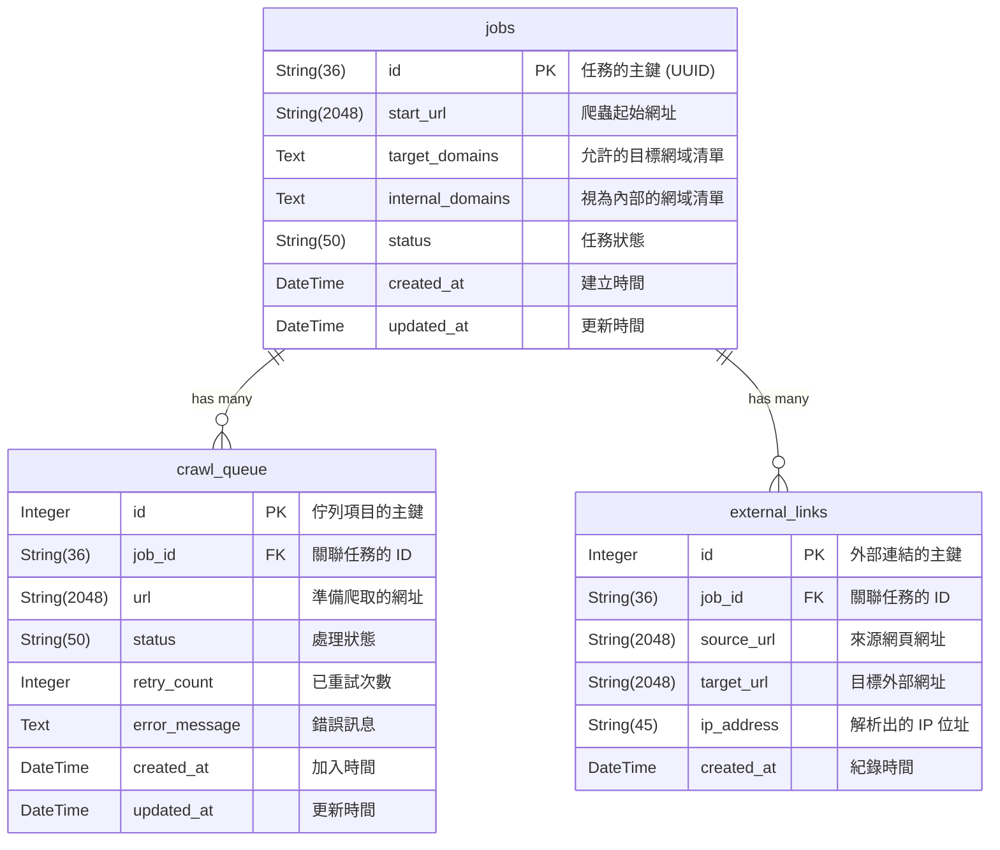

# 資料庫 Schema 說明文件

本文件詳細說明外部連結檢查爬蟲 (`ext-link-checker`) 所使用的 SQLite 資料庫結構。系統透過 SQLAlchemy ORM 進行資料庫操作。

資料庫預設路徑：`db/crawler.db`

---

## 實體關聯圖 (ER Diagram)

---

## 資料表詳細說明

### 1. `jobs` (爬蟲任務表)
此資料表記錄所有被建立的爬蟲任務 (Job) 及其整體狀態與參數。

| 欄位名稱 | 型別 | 限制/預設值 | 說明 |
| :--- | :--- | :--- | :--- |
| `id` | `String(36)` | **Primary Key** | 任務的主鍵，由系統自動產生唯一之 UUID v4 字串。 |
| `start_url` | `String(2048)` | `NOT NULL` | 該任務開始進行爬取的起點網址。 |
| `target_domains` | `Text` | `NOT NULL` | 允許爬蟲深入抓取的網域清單，以逗號 (`,`) 分隔。 |
| `internal_domains` | `Text` | `NOT NULL` | 視為內部系統的網域清單，以逗號 (`,`) 分隔。 |
| `status` | `String(50)` | `Default: 'pending'` | 任務狀態，包含：`pending` (等待中), `running` (執行中), `paused` (已暫停), `completed` (已完成), `error` (發生嚴重例外)。 |
| `created_at` | `DateTime` | `Default: 當下時間` | 任務建立的 UTC 時間戳記。 |
| `updated_at` | `DateTime` | `Default: 當下時間` | 任務最後狀態被更新的 UTC 時間戳記。 |

### 2. `crawl_queue` (爬取佇列清單)
此資料表負責儲存爬蟲過程中需要被抓取的 URL 清單（類似待辦清單），以實作廣度優先或深度優先遍歷。

| 欄位名稱 | 型別 | 限制/預設值 | 說明 |
| :--- | :--- | :--- | :--- |
| `id` | `Integer` | **Primary Key**, `Auto-Increment` | 佇列項目的唯一識別碼。 |
| `job_id` | `String(36)` | **Foreign Key** (`jobs.id`) | 該網址隸屬於哪一個任務。 |
| `url` | `String(2048)` | `NOT NULL` | 準備或已經被爬取之頁面網址。 |
| `status` | `String(50)` | `Default: 'pending'` | 該網址目前的爬取狀態，包含：`pending` (等待爬取), `completed` (爬取成功), `failed` (爬取失敗)。 |
| `retry_count` | `Integer` | `Default: 0` | 爬取發生錯誤並重試的次數，由全域與任務設定控制上限。 |
| `error_message` | `Text` | `Nullable` | 若爬取最後狀態為 `failed`，此欄位會記錄最終發生的例外錯誤訊息。 |
| `created_at` | `DateTime` | `Default: 當下時間` | 網址被發現並加入佇列的時間。 |
| `updated_at` | `DateTime` | `Default: 當下時間` | 網址狀態 (如從 pending 變為 completed) 最後改變的時間。 |

### 3. `external_links` (發現的外部連結)
此資料表負責記錄爬蟲分析網頁 HTML 後，過濾並蒐集到的所有**外部目標連結**，這也是本系統最主要的產出結果。

| 欄位名稱 | 型別 | 限制/預設值 | 說明 |
| :--- | :--- | :--- | :--- |
| `id` | `Integer` | **Primary Key**, `Auto-Increment` | 外部連結紀錄的唯一識別碼。 |
| `job_id` | `String(36)` | **Foreign Key** (`jobs.id`) | 該外部連結是在哪一個任務中被發現的。 |
| `source_url` | `String(2048)` | `NOT NULL` | 發現此外部連結的來源網頁，也就是該連結所在的母網頁。 |
| `target_url` | `String(2048)` | `NOT NULL` | 網頁中提取出的外部連結 `href` 本身。 |
| `ip_address` | `String(45)` | `Nullable` | 透過 DNS 解析該 `target_url` 之網域所取得的 IPv4/IPv6 位址。若解析失敗則為 `NULL`。 |
| `created_at` | `DateTime` | `Default: 當下時間` | 系統成功解析並紀錄該筆外部連結的時間。 |
