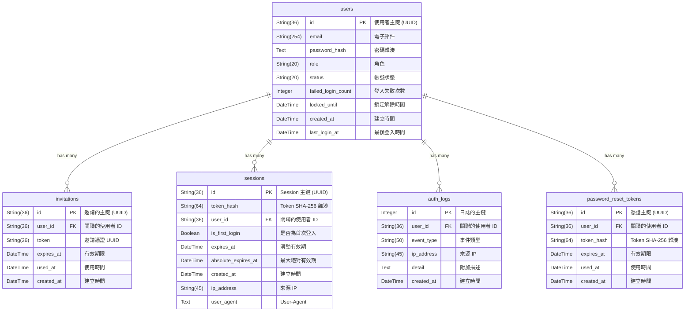
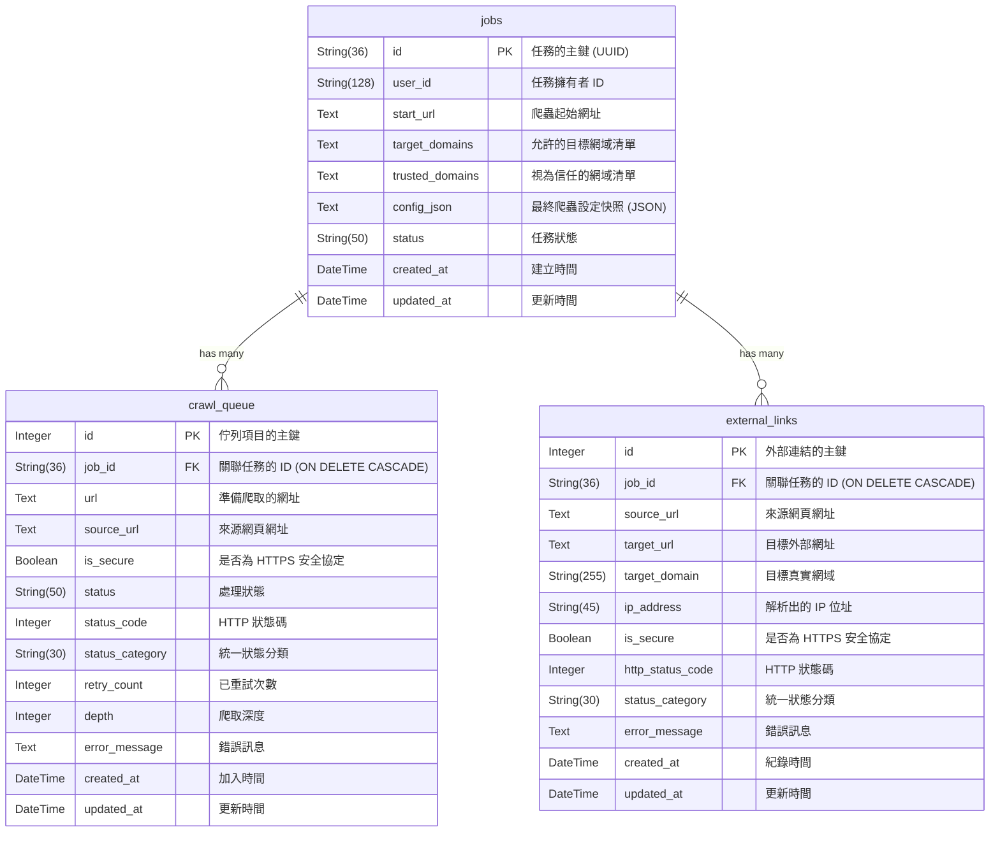

# 資料庫 Schema 說明文件 (Database Schema Documentation)

本文件詳細說明網站連結檢查系統 (`link-checker`) 所使用的資料庫結構。
本專案採用雙資料庫架構，將負責帳號與權限管理的 **Auth DB**，以及負責爬取狀態與結果的 **Crawler DB** 完全分離。系統透過 SQLAlchemy ORM 進行資料庫操作。

---

## 1. 資料庫連線與效能優化 (Database Connection & Optimization)

本系統支援 SQLite 與 PostgreSQL 雙資料庫引擎，並針對不同環境自動套用最佳化連線策略：

* **SQLite 優化 (適用於開發與輕量環境)**：
  建立連線時自動套用 `PRAGMA journal_mode=WAL` (預寫日誌模式)、`synchronous=NORMAL` 與擴大 `cache_size`，極大化降低磁碟 I/O 阻塞；並明確開啟 `foreign_keys=ON` 保障資料關聯完整性。

* **PostgreSQL 優化 (適用於生產環境)**：
  動態偵測 DSN 後，自動啟用 SQLAlchemy 進階連線池 (Connection Pool) 參數。
  * **`pool_size` & `max_overflow`**：提升基礎連線數與突發溢發量，完美支撐 `ThreadPoolExecutor` 的高併發爬取與前端高頻 API 請求。
  * **`pool_pre_ping` (斷線防護)**：每次從連線池取出連線前主動發送輕量級 `SELECT 1`，若因網路波動或伺服器重啟導致連線失效，系統將自動拋棄並重連，徹底解決 `Server closed the connection unexpectedly` 錯誤。

### 1.1 資料庫遷移與 PostgreSQL 序列 (Sequence) 同步

系統支援從 SQLite 完整無縫遷移至 PostgreSQL (`scripts/migrate_sqlite_to_pg.py`)。由於 SQLite 的 AUTOINCREMENT 與 PostgreSQL 的 Sequence 運作機制不同，在跨資料庫批量導入舊資料後，PostgreSQL 的內部序列指標（如 `auth_logs_id_seq`）不會自動更新，這會導致後續新增資料時發生 Primary Key 衝突。

因此，遷移腳本會在導入完成後，自動執行 `setval(pg_get_serial_sequence('table_name', 'id'), coalesce(max(id), 1))`，強制將序列指標推進至目前最大值，保障遷移後的資料庫能立即無縫接軌寫入。

### 1.2 擴充其他資料庫之注意事項

目前系統基於深度效能優化與底層特性的考量，**僅官方支援 SQLite 與 PostgreSQL** 兩種資料庫引擎。若未來專案需要擴充支援其他關聯式資料庫（如 MySQL、MariaDB 等），開發人員必須特別注意以下事項：

1. **連線池參數相容性**：不同資料庫對 SQLAlchemy 的 `pool_size`、`max_overflow` 及斷線重連機制 (`pool_pre_ping`) 支援度可能不同，需針對新引擎重新調校連線策略。
2. **事件監聽器隔離 (Event Listeners)**：目前系統利用 `@event.listens_for(Engine, "connect")` 針對 SQLite 強制開啟 WAL 模式與外鍵約束。擴充時必須確保這些事件攔截器精準綁定在正確的 dialect 上，避免造成其他引擎報錯。
3. **自動遞增與主鍵校正**：MySQL 使用 Auto-Increment 屬性，不需像 PostgreSQL 那樣手動推進 Sequence；但在跨庫遷移資料時，仍需針對新引擎的主鍵跳號與外鍵更新行為 (`ON UPDATE CASCADE` 支援度) 編寫專屬防護邏輯。
4. **時區處理 (Timezone)**：為相容 SQLite，系統目前統一採用無時區資訊 (Naive UTC) 進行寫入。若引入對時區嚴格敏感的引擎，需審慎評估是否改用 `DateTime(timezone=True)` 並處理向下相容問題。
5. **批次寫入與 Upsert 語法相容性**：PostgreSQL 與 SQLite 均支援 `INSERT ... ON CONFLICT DO NOTHING`，但 SQLAlchemy 需要針對不同方言載入專屬的 `insert` 模組。在實作去重防護的批次寫入時，嚴禁在業務邏輯層直接寫死特定方言，必須統一在 `crawler/utils.py` 中封裝跨資料庫的輔助函式（例如動態判斷 `session.bind.dialect.name`）。

> [!TIP]
> **客製化程式碼位置**：
> * **引擎與參數調校**：以上提及的 SQLAlchemy 引擎參數動態調校、以及 SQLite 專屬的效能事件攔截器（Event Listeners）實作，皆集中於 `crawler/utils.py` 中的 `create_optimized_engine` 函數內。若需擴充資料庫，請直接從該處開始。
> * **Auth DB 連線與 SessionMaker**：位於 `backend/auth/db.py` 中，透過 `get_auth_session_local()` 進行初始化與調用。
> * **Crawler DB 連線與 SessionMaker**：統一由 Crawler 核心引擎 `crawler/manager.py` 中的 `JobManager` 管理，FastAPI 則透過 `backend/deps.py` 的依賴注入取得其連線。

### 1.3 查詢效能優化與 ORM 避坑指南 (Query Optimization & ORM Pitfalls)

在同時兼容 SQLite 與 PostgreSQL 的雙引擎架構下，開發人員在撰寫 SQLAlchemy ORM 查詢時，必須特別注意以下效能陷阱與語法相容性：

1. **規避 PostgreSQL `ORDER BY ... LIMIT` 全表掃描陷阱**：
   * **問題情境**：在實作分頁查詢時，如果 `WHERE` 條件非常稀疏（例如在數百萬筆成功的連結中，只過濾出數十筆失效連結），並搭配 `ORDER BY id LIMIT 50`。PostgreSQL 的 Query Planner 為了節省排序成本，極易自作聰明地選擇循序掃描 Primary Key (`id`) 索引，期望能「邊掃描邊過濾，找到 50 筆就停下來」，最終卻導致災難性的 Full Table Scan，完全無視我們為失效狀態建立的高效 Partial Index。
   * **優化策略**：在呼叫 `execute_paginated_query` 或自訂分頁排序時，請將排序欄位從單純的屬性轉換為**數學表達式**（例如使用 `default_sort=CrawlQueue.id + 0` 取代 `default_sort=CrawlQueue.id`）。這個小技巧會破壞 PostgreSQL 依賴主鍵索引排序的意圖，強迫優化器先去走 Partial Index 撈出極少數的資料後，再放入記憶體排序，查詢時間將從數十秒驟降至幾毫秒。
   * **相容性**：SQLite 同樣支援 `id + 0` 這類運算式排序，此修改百分之百相容，且同樣能達成索引避險的效果。

2. **嚴謹的 SQLAlchemy Boolean 條件映射**：
   * **問題情境**：為了加速過濾出非安全協定的連結，我們在 `models.py` 建立了 Partial Index：`postgresql_where=text("... OR is_secure = false")` 以及 `sqlite_where=text("... OR is_secure = 0")`。但在 SQLAlchemy 撰寫查詢時，若使用 `.is_(False)`，它會產生出 `IS false` 的 SQL 語法。
   * **優化策略**：在 PostgreSQL 中，`IS false` 與 `= false` 在抽象語法樹 (AST) 裡是完全不同的結構，會導致優化器判定索引條件不符而放棄使用 Partial Index。開發時**絕對禁止使用 `.is_(False)`**，請一律使用 `== False`。
   * **相容性**：SQLAlchemy 極度聰明，當遇到 `== False` 時，在 PostgreSQL 會完美轉譯為 `= false`，而在 SQLite 則會轉譯為 `= 0`，完美對接兩種資料庫的 Partial Index 宣告。

### 1.4 實體外鍵 (Physical FK) vs. 邏輯外鍵 (Logical FK) 策略

本專案分為 Auth DB 與 Crawler DB 兩個獨立的資料庫，在關聯設計上有截然不同的策略，開發或刪除資料時需特別留意：

1. **Crawler DB（實體外鍵保護）**：
   在 Crawler DB 中（如 `crawl_queue` 與 `external_links` 對應到 `jobs` 表），均設有明確的實體外鍵 (Physical Foreign Key)，並且啟用了 `ON DELETE CASCADE`。這表示當您刪除任務時，底下的關聯資料會由資料庫自動級聯刪除，保障資料一致性。

2. **Auth DB（應用層邏輯外鍵）**：
   在 Auth DB 內（如 `users` 與 `sessions`、`invitations`、`auth_logs` 之間），採用的是**邏輯外鍵 (Logical FK)**。資料表結構上並沒有建立實體的外鍵約束。這代表當您刪除一位使用者時，相關的 Session、日誌或邀請碼**不會被資料庫自動刪除**，必須依賴後端程式碼（應用層）來進行清理，或是保留為孤兒紀錄（例如安全稽核日誌通常即使刪除帳號也需要永久保留）。

---

## 2. 帳號資料庫 (Auth DB)

負責帳號管理、身分驗證與安全稽核日誌。
系統預設路徑為 `db/auth.db`，也可透過 `.env` 檔案中的 `AUTH_DB_URL` 環境變數自訂（例如指定為 `sqlite:///db/auth.db`，或於測試時動態切換）。

### 實體關聯圖 (ER Diagram)

### 資料表詳細說明

#### `users` (使用者帳號表)
此資料表記錄使用者的基本資訊與帳號狀態。

| 欄位名稱 | 型別 | 限制/預設值 | 說明 |
| :--- | :--- | :--- | :--- |
| `id` | `String(36)` | **Primary Key** | 使用者的主鍵，UUID v4 字串。 |
| `email` | `String(254)` | `UNIQUE`, `NOT NULL` | 使用者電子郵件（唯一，作為登入帳號）。 |
| `password_hash` | `Text` | `Nullable` | bcrypt 雜湊後的密碼。首次登入設密前為 `NULL`。 |
| `role` | `String(20)` | `Default: 'user'` | 帳號角色，如 `user` 或 `admin`。 |
| `status` | `String(20)` | `Default: 'pending'` | 帳號狀態：`pending` / `active` / `suspended` / `expired`。 |
| `failed_login_count` | `Integer` | `Default: 0` | 連續登入失敗次數（用於帳號鎖定防護）。 |
| `locked_until` | `DateTime` | `Nullable` | 帳號鎖定解除時間（`NULL` 代表未鎖定）。 |
| `created_at` | `DateTime` | `Default: 當下 UTC 時間` | 帳號建立的 UTC 時間戳記。 |
| `last_login_at` | `DateTime` | `Nullable` | 最後一次成功登入的 UTC 時間戳記。 |

#### `invitations` (邀請憑證表)
此資料表記錄系統發送給受邀者的一次性邀請連結與憑證。

| 欄位名稱 | 型別 | 限制/預設值 | 說明 |
| :--- | :--- | :--- | :--- |
| `id` | `String(36)` | **Primary Key** | 邀請紀錄的主鍵，UUID v4 字串。 |
| `user_id` | `String(36)` | **Logical FK**, `NOT NULL` | 關聯的受邀使用者 ID (`users.id`)。於應用層控管關聯，未設定實體外鍵約束。 |
| `token` | `String(36)` | `UNIQUE`, `NOT NULL` | 邀請 UUID 憑證（單次使用）。 |
| `expires_at` | `DateTime` | `NOT NULL` | 此邀請連結的有效期限。 |
| `used_at` | `DateTime` | `Nullable` | 憑證被使用的時間（`NULL` 代表尚未使用）。 |
| `created_at` | `DateTime` | `Default: 當下 UTC 時間` | 邀請建立的 UTC 時間戳記。 |

##### 索引資訊 (Indexes)
* **`uq_invitations_token`**: `(token)` 唯一約束。
* **`ix_invitations_user_id`**: `(user_id)` 用於快速查詢使用者的邀請紀錄。

#### `sessions` (連線 Session 表)
儲存有效登入者的 Session 資訊。為防範資料庫外洩，Token 僅儲存其 SHA-256 雜湊值。

| 欄位名稱 | 型別 | 限制/預設值 | 說明 |
| :--- | :--- | :--- | :--- |
| `id` | `String(36)` | **Primary Key** | Session 的主鍵，UUID v4 字串。 |
| `token_hash` | `String(64)` | `UNIQUE`, `NOT NULL` | Session Token 的 SHA-256 雜湊值。 |
| `user_id` | `String(36)` | **Logical FK**, `NOT NULL` | 關聯的使用者 ID (`users.id`)。於應用層控管關聯，未設定實體外鍵約束。 |
| `is_first_login` | `Boolean` | `Default: False` | 標記是否為首次登入的暫態 Session（設密完成前為 True）。 |
| `expires_at` | `DateTime` | `NOT NULL` | 滑動有效期（每次有效請求後重置）。 |
| `absolute_expires_at` | `DateTime` | `NOT NULL` | 最大絕對有效期（不受滑動影響，到達後強制登出）。 |
| `created_at` | `DateTime` | `Default: 當下 UTC 時間` | Session 建立時間。 |
| `ip_address` | `String(45)` | `Nullable` | 建立 Session 時的客戶端來源 IP 位址。 |
| `user_agent` | `Text` | `Nullable` | 建立 Session 時的瀏覽器 User-Agent 資訊。 |

##### 索引資訊 (Indexes)
* **`uq_sessions_token_hash`**: `(token_hash)` 唯一約束。
* **`ix_sessions_user_id`**: `(user_id)` 支援同一帳號多裝置登入管理。

#### `password_reset_tokens` (密碼重設憑證表)
記錄使用者忘記密碼時申請的重設憑證。憑證以雜湊儲存防範外洩，且具備時效與單次使用限制。

| 欄位名稱 | 型別 | 限制/預設值 | 說明 |
| :--- | :--- | :--- | :--- |
| `id` | `String(36)` | **Primary Key** | 憑證紀錄的主鍵，UUID v4 字串。 |
| `user_id` | `String(36)` | **Logical FK**, `NOT NULL` | 關聯的受邀使用者 ID (`users.id`)。於應用層控管關聯，未設定實體外鍵約束。 |
| `token_hash` | `String(64)` | `UNIQUE`, `NOT NULL` | 重設 Token 的 SHA-256 雜湊值。 |
| `expires_at` | `DateTime` | `NOT NULL` | 此重設連結的有效期限。 |
| `used_at` | `DateTime` | `Nullable` | 憑證被使用的時間（`NULL` 代表尚未使用）。 |
| `created_at` | `DateTime` | `Default: 當下 UTC 時間` | 憑證建立的 UTC 時間戳記。 |

##### 索引資訊 (Indexes)
* **`uq_password_reset_tokens_token_hash`**: `(token_hash)` 唯一約束。
* **`ix_password_reset_tokens_user_id`**: `(user_id)` 快速查詢使用者的重設紀錄。

#### `auth_logs` (身分驗證日誌表)
記錄系統中與身分驗證相關的所有重大安全性事件，作為後續安全稽核的依據。

| 欄位名稱 | 型別 | 限制/預設值 | 說明 |
| :--- | :--- | :--- | :--- |
| `id` | `Integer` | **Primary Key**, `Auto-Increment` | 日誌的主鍵。 |
| `user_id` | `String(36)` | **Logical FK**, `Nullable` | 關聯的使用者 ID（部分事件可能無法確定使用者）。於應用層控管關聯，未設定實體外鍵約束。 |
| `event_type` | `String(50)` | `NOT NULL` | 事件類型：`first_login_attempt`, `login_success`, `login_failed`, `logout`, `locked`, `password_set`, `password_changed`, `password_reset_requested`, `password_reset_success`, `invitation_sent`, `user_status_changed`, `user_deleted`, `job_force_action`, `config_change` 等。 |
| `ip_address` | `String(45)` | `Nullable` | 事件發生時的客戶端來源 IP 位址。 |
| `detail` | `Text` | `Nullable` | 附加描述資訊（如登入失敗原因，或在敏感操作時以 JSON 格式記錄變更前後差異細節）。 |
| `created_at` | `DateTime` | `Default: 當下 UTC 時間` | 事件發生的 UTC 時間戳記。 |

##### 索引資訊 (Indexes)
* **`ix_auth_logs_user_id`**: `(user_id)` 快速查詢單一使用者的所有事件。
* **`ix_auth_logs_created_at`**: `(created_at)` 快速依照時間區段篩選系統日誌。

---

## 3. 爬蟲資料庫 (Crawler DB)

負責記錄爬蟲任務設定、內部網頁的健康診斷佇列與所探索到的外部連結結果。
系統預設路徑為 `db/crawler.db`，也可透過 `.env` 檔案中的 `CRAWLER_DB_URL` 環境變數自訂（或於測試時切換至隔離的測試資料庫）。

### 實體關聯圖 (ER Diagram)

### 資料表詳細說明

#### `jobs` (爬蟲任務表)
此資料表記錄所有被建立的爬蟲任務 (Job) 及其整體狀態與參數。

| 欄位名稱 | 型別 | 限制/預設值 | 說明 |
| :--- | :--- | :--- | :--- |
| `id` | `String(36)` | **Primary Key** | 任務的主鍵，由系統自動產生唯一之 UUID v4 字串。 |
| `user_id` | `String(128)` | `Nullable`, `Index` | 該任務的擁有者 ID。預設為 `NULL`（代表系統匿名建立）。 |
| `start_url` | `Text` | `NOT NULL` | 該任務開始進行爬取的起點網址。 |
| `target_domains` | `Text` | `NOT NULL` | 允許爬蟲深入抓取的網域清單，以逗號 (`,`) 分隔。 |
| `trusted_domains` | `Text` | `NOT NULL` | 視為信任系統的網域清單，以逗號 (`,`) 分隔。 |
| `config_json` | `Text` | `Nullable` | 任務建立當下，已與全域設定合併之最終爬蟲參數快照 (JSON 格式)。註：為落實最小權限，後端 API 提取此快照時會主動進行機密遮蔽 (如 Proxy 密碼)。 |
| `status` | `String(50)` | `Default: 'pending'` | 任務狀態，包含：`pending` (等待中), `running` (執行中), `paused` (已暫停), `completed` (已完成), `error` (發生嚴重例外)。 |
| `created_at` | `DateTime` | `Default: 當下時間` | 任務建立的 UTC 時間戳記。 |
| `updated_at` | `DateTime` | `Default: 當下時間` | 任務最後狀態被更新的 UTC 時間戳記。 |

##### 索引資訊 (Indexes)
* **`ix_jobs_user_id`** (單一索引): `(user_id)`。用於快速過濾與查詢特定使用者的歷史任務。

##### 任務狀態 (`status`) 說明：
* **`pending` (等待中)**：任務剛剛被建立，但尚未被爬蟲管理器啟動。
* **`running` (執行中)**：任務正在進行中，佇列中的網址正被陸續抓取。
* **`paused` (已暫停)**：任務執行到一半，因使用者手動中斷 (如按下 `Ctrl+C`) 或暫停指令而停止，後續可再次恢復執行 (`resume`)。
* **`completed` (已完成)**：任務所屬的 `crawl_queue` 已經全部處理完畢，任務順利結束。
* **`error` (發生嚴重例外)**：任務在執行過程中發生未預期的系統層級錯誤（例如資料庫寫入失敗）而被迫異常終止。

#### `crawl_queue` (內部網頁診斷佇列)
此資料表負責儲存爬蟲過程中需要被抓取的 URL 清單（類似待辦清單），除了用於實作廣度/深度優先遍歷外，更身兼**內部網頁健康診斷報表**的核心角色。

| 欄位名稱 | 型別 | 限制/預設值 | 說明 |
| :--- | :--- | :--- | :--- |
| `id` | `Integer` | **Primary Key**, `Auto-Increment` | 佇列項目的唯一識別碼。 |
| `job_id` | `String(36)` | **Foreign Key** (`jobs.id`, `ON DELETE CASCADE`) | 該網址隸屬於哪一個任務。 |
| `url` | `Text` | `NOT NULL` | 準備或已經被爬取之頁面網址。 |
| `source_url` | `Text` | `Nullable` | 發現此網址的來源網頁網址 (若是任務的起始網址則為 NULL)。 |
| `is_secure` | `Boolean` | `Default: True` | 標記此內部連結是否使用安全傳輸協定（網址開頭為 `https://`）。若為 HTTPS 則為 `True`，若為 HTTP 則為 `False`。 |
| `status` | `String(50)` | `Default: 'pending'` | 該網址目前的爬取狀態，包含：`pending` (等待爬取), `completed` (爬取成功), `failed` (爬取失敗), `skip` (因 MIME 或副檔名不符而跳過), `warning` (因超過容量上限被截斷)。 |
| `status_code` | `Integer` | `Nullable` | 記錄爬取最終的 HTTP 狀態碼。前端與匯出引擎藉由綜合判斷此欄位與 `error_message`，將內部失敗動態歸類為 7 大失效樣態 (資源遺失、伺服器異常、權限不足、連線逾時、底層異常、網頁截斷、其他)。 |
| `status_category` | `String(30)` | `Default: 'pending'` | 統一狀態分類（例如：`timeout`, `not_found`, `server_error` 等），透過分析程式於背景解析或回填，直接支援統計聚合查詢。 |
| `retry_count` | `Integer` | `Default: 0` | 爬取發生錯誤並重試的次數，由全域與任務設定控制上限。 |
| `depth` | `Integer` | `Default: 0` | 記錄此網址被發現的爬取深度。起始網址深度為 `0`，子網址為 `current_depth + 1`。 |
| `error_message` | `Text` | `Nullable` | 若爬取最後狀態為 `failed`，此欄位會記錄最終發生的例外錯誤訊息。 |
| `created_at` | `DateTime` | `Default: 當下時間` | 網址被發現並加入佇列的時間。 |
| `updated_at` | `DateTime` | `Default: 當下時間` | 網址狀態 (如從 pending 變為 completed) 最後改變的時間。 |

##### 索引資訊 (Indexes)
為了加快查重以及尋找下一筆 `pending` 網址的效率，此表定義了以下複合索引：
* **`ix_crawl_queue_job_url`**: `(job_id, url)`。用於去重檢查（避免全表掃描）。
* **`ix_crawl_queue_job_status_id`**: `(job_id, status, id)`。用於極速提取下一個待爬取的佇列網址（包含排序）。
* **`ix_crawl_queue_job_category`**: `(job_id, status_category)`。用於加速 API 的分類統計聚合查詢。
* **`ix_crawl_queue_internal_issues`** (部分索引 / Partial Index): 僅針對 `(job_id)` 建立，並過濾條件 `WHERE status IN ('failed', 'warning') OR is_secure = false` (或 SQLite 的 `= 0`)。此索引專門設計用來避開數百萬筆成功連結，以毫秒級速度極速撈出有問題的內部連結報表，並完美配合 `id + 0` 數學表達式規避分頁排序的效能陷阱。

#### `external_links` (發現的外部連結)
此資料表負責記錄爬蟲分析網頁 HTML 後，過濾並蒐集到的所有**外部目標連結**。這與 `crawl_queue` 共同構成系統最核心的連結健康度診斷產出。

| 欄位名稱 | 型別 | 限制/預設值 | 說明 |
| :--- | :--- | :--- | :--- |
| `id` | `Integer` | **Primary Key**, `Auto-Increment` | 外部連結紀錄的唯一識別碼。 |
| `job_id` | `String(36)` | **Foreign Key** (`jobs.id`, `ON DELETE CASCADE`) | 該外部連結是在哪一個任務中被發現的。 |
| `source_url` | `Text` | `NOT NULL` | 發現此外部連結的來源網頁，也就是該連結所在的母網頁。 |
| `target_url` | `Text` | `NOT NULL` | 網頁中提取出的外部連結 `href` 本身。 |
| `target_domain` | `String(255)` | `NOT NULL`, `Default: ''` | 紀錄經過重定向 (Redirect) 後最終抵達的真實網域，用於精確的按網域分群統計。舊資料可透過 `backfill_target_domain.py` 腳本回填。 |
| `ip_address` | `String(45)` | `Nullable` | 透過 DNS 解析該 `target_url` 之網域所取得的 IPv4/IPv6 位址。若解析失敗則為 `NULL`。 |
| `is_secure` | `Boolean` | `Default: True` | 標記此外部連結是否使用安全傳輸協定（網址開頭為 `https://`）。若為 HTTPS 則為 `True`，若為 HTTP 則為 `False`。 |
| `http_status_code` | `Integer` | `Nullable` | 對外部連結進行 HTTP 存活檢查後取得的 HTTP 狀態碼。若為 `NULL` 代表未探測或連線失敗。 |
| `status_category` | `String(30)` | `Default: 'pending'` | 統一狀態分類（例如：`pending`, `dns_failed`, `connection_error`, `healthy` 等），可用於極速生成報表與統計。 |
| `error_message` | `Text` | `Nullable` | 存活檢查失敗時的具體連線異常描述（如 ConnectionTimeout）。 |
| `created_at` | `DateTime` | `Default: 當下時間` | 系統成功解析並紀錄該筆外部連結的時間。 |
| `updated_at` | `DateTime` | `Default: 當下時間` | 此筆外部連結狀態最後更新的時間。 |

##### 索引與唯一約束資訊 (Indexes & Constraints)
* **`uq_external_links_job_src_tgt`** (唯一約束): `(job_id, source_url, target_url)`。防止在同一任務中重複記錄相同的來源與目標組合。
  > **索引說明**：根據**最左前綴原則 (Leftmost Prefix Rule)**，此約束產生的複合索引已包含 `(job_id, source_url)` 前綴。因此在進行 `group_by=source` 查詢時，資料庫可直接使用此索引，不需額外建立 `source_url` 的專屬索引。
* **`ix_external_links_job_created`** (複合索引): `(job_id, created_at)`。用於分頁與依時間排序。
* **`ix_external_links_job_category`** (複合索引): `(job_id, status_category)`。用於分類篩選與統計摘要。
* **`ix_external_links_job_domain`** (複合索引): `(job_id, target_domain)`。用於 `group_by=domain` 的群組統計。
* **`ix_external_links_job_target`** (複合索引): `(job_id, target_url)`。用於加速 `group_by=target` 查詢，避免全表掃描。
* **`ix_external_links_insecure_issues`** (部分索引 / Partial Index): 僅針對 `(job_id)` 建立，過濾條件為 `WHERE is_secure = false` (或 SQLite 的 `= 0`)。用於快速查詢非 HTTPS 的外部連結，並可搭配 `id + 0` 數學表達式來規避 PostgreSQL 的分頁排序效能問題。

---

## 4. 統一狀態分類 (`status_category`) 定義參考

為了提升統計與聚合查詢的效能，系統在 `crawl_queue` (內部連結) 與 `external_links` (外部連結) 中皆實作了 `status_category` 欄位。這些分類是在資料寫入或背景回填時，依據底層的 HTTP 狀態碼、IP 解析結果與錯誤訊息，預先計算好的標準化結果。

### `external_links` (外部連結) 的狀態分類
| 分類代碼 | 說明 | 判斷邏輯 |
| :--- | :--- | :--- |
| **`healthy`** | 正常連結 | HTTP 狀態碼 < 400 |
| **`pending`** | 待測連結 | (由局部重測觸發) 狀態已被重置，等待背景引擎重新探測 |
| **`dns_failed`** | DNS 錯誤 | 網域無法解析出任何 IP 位址 |
| **`not_found`** | 資源遺失 | HTTP 狀態碼為 404 或 410 |
| **`server_error`** | 伺服器異常 | HTTP 狀態碼落在 500 ~ 599 之間 |
| **`connection_error`** | 底層異常 | DNS 成功但無法取得狀態碼 (例如連線逾時、連線被拒絕、SSL 憑證失敗等) |
| **`other_error`** | 其他異常 | HTTP 狀態碼 >= 400，且不屬於上述其他錯誤類別 |
| **`blocked`** | 權限阻擋 | HTTP 狀態碼為 401, 403, 405, 406 或 429 |

### `crawl_queue` (內部連結) 的狀態分類
內部連結的 `status_category` 是建立在原本的 `status` 基礎上。若狀態並非 `failed`，分類與 `status` 一致；若為 `failed`，則進一步細分錯誤樣態：
| 分類代碼 | 說明 | 判斷邏輯 |
| :--- | :--- | :--- |
| **`pending`** | 等待爬取 | 尚未開始執行的佇列項目 |
| **`completed`** | 成功爬取 | 成功抓取 HTML 內容並解析 |
| **`skip`** | 跳過爬取 | 因不符合網域、或資源類型 (MIME/副檔名) 排除而跳過 |
| **`server_error`** | 伺服器異常 | [失敗類] HTTP 狀態碼落在 500 ~ 599 之間 |
| **`connection_error`** | 底層異常 | [失敗類] 無狀態碼且非屬連線逾時的底層錯誤 (例如 DNS 解析失敗、憑證無效或連線被拒等) |
| **`timeout`** | 連線逾時 | [失敗類] 無狀態碼且例外訊息中包含 timeout 關鍵字 |
| **`not_found`** | 資源遺失 | [失敗類] HTTP 狀態碼為 404 或 410 |
| **`other_error`** | 其他異常 | [失敗類] 其他未分類的 HTTP 異常狀態碼 |
| **`warning`** | 網頁截斷 | [失敗類] 爬取有異狀但不算完全失敗 (例如檔案過大被截斷) |
| **`blocked`** | 權限阻擋 | [失敗類] HTTP 狀態碼為 401, 403, 405, 406 或 429 |

### API 與 CLI 過濾器 (`filter`) 對應關係

在系統的 API 與 CLI 工具中，使用者可透過 `filter` 參數快速篩選結果。
基本原理上，`filter` 參數的多數值會**直接一對一映射**到資料庫的 `status_category` 欄位（例如傳入 `not_found` 就會直接查詢 `status_category = 'not_found'`）。

為了實務查詢的便利性，系統針對**外部連結**額外提供了幾種複合查詢的假名 (Alias) 或進階過濾條件。與 `status_category` **不屬於一對一直接對應**的特殊 `filter` 參數表列如下：

| 特殊 Filter 名稱 | 在資料庫的實際查詢行為 |
| :--- | :--- |
| `dead` | 等同於查詢 `status_category = 'dns_failed'` 的別名。 |
| `broken` | **(複合條件)** 比對 `status_category IN ('not_found', 'server_error', 'connection_error', 'other_error')`。此為廣義的失效連結集合，但不包含 `dns_failed` 與 `blocked`。 |
| `insecure` | **(進階條件)** 僅比對 `is_secure = False` (與 `status_category` 欄位無關)。 |
| `all` | 無篩選條件，回傳所有資料。 |

> **註解**：除了上述四個特殊參數外，其餘所有過濾參數（包含內部連結的所有過濾條件）皆為 `filter == status_category` 的直接一對一比對。
