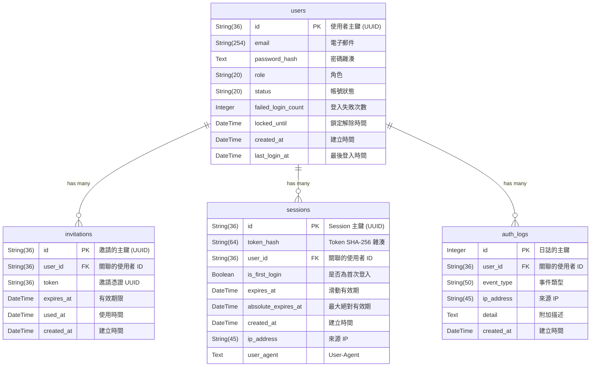
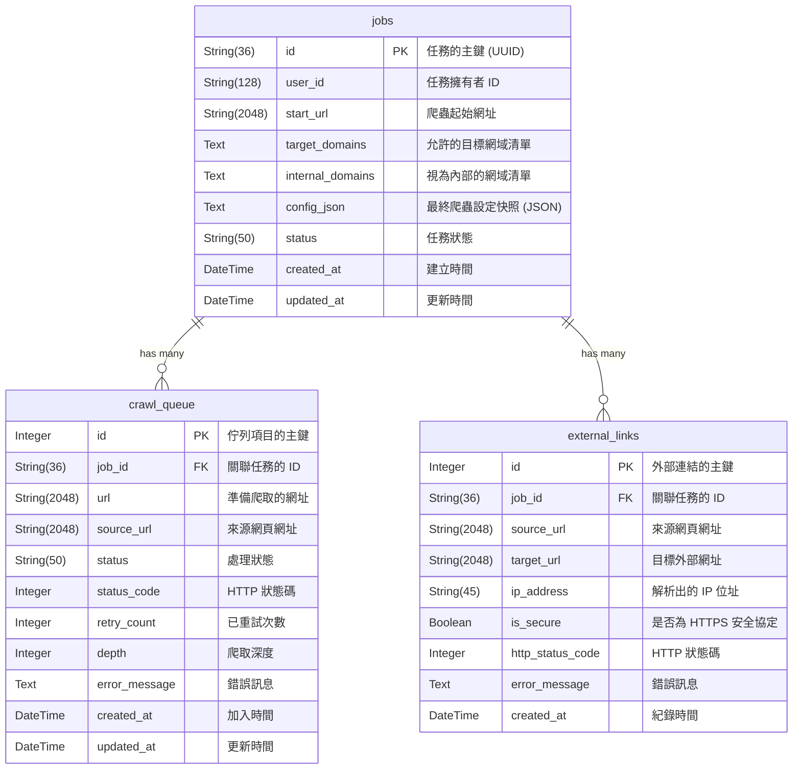

# 資料庫 Schema 說明文件 (Database Schema Documentation)

本文件詳細說明外部連結檢查爬蟲 (`ext-link-checker`) 所使用的資料庫結構。
本專案採用雙資料庫架構，將負責帳號與權限管理的 **Auth DB**，以及負責爬取狀態與結果的 **Crawler DB** 完全分離。系統透過 SQLAlchemy ORM 進行資料庫操作。

---

## 1. 爬蟲與資料庫效能優化 (SQLite Connection Optimization)

為了將高頻寫入與提交 (commit) 的磁碟 I/O 開銷降至最低，系統在建立 SQLite 連線時會自動套用以下 PRAGMA 優化參數（適用於 Auth DB 與 Crawler DB 連線）：
* **WAL 模式** (`PRAGMA journal_mode=WAL`)：啟用預寫日誌模式，藉此允許併發讀寫並極大加速寫入速度。
* **NORMAL 同步** (`PRAGMA synchronous=NORMAL`)：在 WAL 模式下可兼顧安全性與高寫入效能，避免磁碟刷寫的 I/O 阻塞。
* **快取大小** (`PRAGMA cache_size=5000` / `10000`)：設定分頁快取記憶體以減少實體磁碟讀取次數。
* **外鍵約束** (`PRAGMA foreign_keys=ON`)：啟用 SQLite 的外鍵約束檢查，確保關聯資料完整性。

---

## 2. 帳號資料庫 (Auth DB)

負責帳號管理、身分驗證與安全稽核日誌。
預設路徑：`db/auth.db`

### 實體關聯圖 (ER Diagram)

### 資料表詳細說明

#### `users` (使用者帳號表)
此資料表記錄使用者的基本資訊與帳號狀態。

| 欄位名稱 | 型別 | 限制/預設值 | 說明 |
| :--- | :--- | :--- | :--- |
| `id` | `String(36)` | **Primary Key** | 使用者的主鍵，UUID v4 字串。 |
| `email` | `String(254)` | `UNIQUE`, `NOT NULL` | 使用者電子郵件（唯一，作為登入帳號）。 |
| `password_hash` | `Text` | `Nullable` | bcrypt 雜湊後的密碼。首次登入設密前為 `NULL`。 |
| `role` | `String(20)` | `Default: 'user'` | 帳號角色，如 `user` 或 `admin`。 |
| `status` | `String(20)` | `Default: 'pending'` | 帳號狀態：`pending` / `active` / `suspended` / `expired`。 |
| `failed_login_count` | `Integer` | `Default: 0` | 連續登入失敗次數（用於帳號鎖定防護）。 |
| `locked_until` | `DateTime` | `Nullable` | 帳號鎖定解除時間（`NULL` 代表未鎖定）。 |
| `created_at` | `DateTime` | `Default: 當下 UTC 時間` | 帳號建立的 UTC 時間戳記。 |
| `last_login_at` | `DateTime` | `Nullable` | 最後一次成功登入的 UTC 時間戳記。 |

#### `invitations` (邀請憑證表)
此資料表記錄系統發送給受邀者的一次性邀請連結與憑證。

| 欄位名稱 | 型別 | 限制/預設值 | 說明 |
| :--- | :--- | :--- | :--- |
| `id` | `String(36)` | **Primary Key** | 邀請紀錄的主鍵，UUID v4 字串。 |
| `user_id` | `String(36)` | **Foreign Key**, `NOT NULL` | 關聯的受邀使用者 ID (`users.id`)。 |
| `token` | `String(36)` | `UNIQUE`, `NOT NULL` | 邀請 UUID 憑證（單次使用）。 |
| `expires_at` | `DateTime` | `NOT NULL` | 此邀請連結的有效期限。 |
| `used_at` | `DateTime` | `Nullable` | 憑證被使用的時間（`NULL` 代表尚未使用）。 |
| `created_at` | `DateTime` | `Default: 當下 UTC 時間` | 邀請建立的 UTC 時間戳記。 |

##### 索引資訊 (Indexes)
* **`uq_invitations_token`**: `(token)` 唯一約束。
* **`ix_invitations_user_id`**: `(user_id)` 用於快速查詢使用者的邀請紀錄。

#### `sessions` (連線 Session 表)
儲存有效登入者的 Session 資訊。為防範資料庫外洩，Token 僅儲存其 SHA-256 雜湊值。

| 欄位名稱 | 型別 | 限制/預設值 | 說明 |
| :--- | :--- | :--- | :--- |
| `id` | `String(36)` | **Primary Key** | Session 的主鍵，UUID v4 字串。 |
| `token_hash` | `String(64)` | `UNIQUE`, `NOT NULL` | Session Token 的 SHA-256 雜湊值。 |
| `user_id` | `String(36)` | **Foreign Key**, `NOT NULL` | 關聯的使用者 ID (`users.id`)。 |
| `is_first_login` | `Boolean` | `Default: False` | 標記是否為首次登入的暫態 Session（設密完成前為 True）。 |
| `expires_at` | `DateTime` | `NOT NULL` | 滑動有效期（每次有效請求後重置）。 |
| `absolute_expires_at` | `DateTime` | `NOT NULL` | 最大絕對有效期（不受滑動影響，到達後強制登出）。 |
| `created_at` | `DateTime` | `Default: 當下 UTC 時間` | Session 建立時間。 |
| `ip_address` | `String(45)` | `Nullable` | 建立 Session 時的客戶端來源 IP 位址。 |
| `user_agent` | `Text` | `Nullable` | 建立 Session 時的瀏覽器 User-Agent 資訊。 |

##### 索引資訊 (Indexes)
* **`uq_sessions_token_hash`**: `(token_hash)` 唯一約束。
* **`ix_sessions_user_id`**: `(user_id)` 支援同一帳號多裝置登入管理。

#### `auth_logs` (身分驗證日誌表)
記錄系統中與身分驗證相關的所有重大安全性事件，作為後續安全稽核的依據。

| 欄位名稱 | 型別 | 限制/預設值 | 說明 |
| :--- | :--- | :--- | :--- |
| `id` | `Integer` | **Primary Key**, `Auto-Increment` | 日誌的主鍵。 |
| `user_id` | `String(36)` | **Foreign Key**, `Nullable` | 關聯的使用者 ID（部分事件可能無法確定使用者）。 |
| `event_type` | `String(50)` | `NOT NULL` | 事件類型：`login_success`, `login_failed`, `logout`, `locked`, `password_set`, `password_changed`, `invitation_sent`, `user_status_changed`, `user_deleted`, `job_force_action`, `config_change` 等。 |
| `ip_address` | `String(45)` | `Nullable` | 事件發生時的客戶端來源 IP 位址。 |
| `detail` | `Text` | `Nullable` | 附加描述資訊（如登入失敗原因，或在敏感操作時以 JSON 格式記錄變更前後差異細節）。 |
| `created_at` | `DateTime` | `Default: 當下 UTC 時間` | 事件發生的 UTC 時間戳記。 |

##### 索引資訊 (Indexes)
* **`ix_auth_logs_user_id`**: `(user_id)` 快速查詢單一使用者的所有事件。
* **`ix_auth_logs_created_at`**: `(created_at)` 快速依照時間區段篩選系統日誌。

---

## 3. 爬蟲資料庫 (Crawler DB)

負責記錄爬蟲任務設定、待爬取 URL 佇列與所探索到的外部連結結果。
預設路徑：`db/crawler.db`

### 實體關聯圖 (ER Diagram)

### 資料表詳細說明

#### `jobs` (爬蟲任務表)
此資料表記錄所有被建立的爬蟲任務 (Job) 及其整體狀態與參數。

| 欄位名稱 | 型別 | 限制/預設值 | 說明 |
| :--- | :--- | :--- | :--- |
| `id` | `String(36)` | **Primary Key** | 任務的主鍵，由系統自動產生唯一之 UUID v4 字串。 |
| `user_id` | `String(128)` | `Nullable`, `Index` | 該任務的擁有者 ID。預設為 `NULL`（代表系統匿名建立）。 |
| `start_url` | `String(2048)` | `NOT NULL` | 該任務開始進行爬取的起點網址。 |
| `target_domains` | `Text` | `NOT NULL` | 允許爬蟲深入抓取的網域清單，以逗號 (`,`) 分隔。 |
| `internal_domains` | `Text` | `NOT NULL` | 視為內部系統的網域清單，以逗號 (`,`) 分隔。 |
| `config_json` | `Text` | `Nullable` | 任務建立當下，已與全域設定合併之最終爬蟲參數快照 (JSON 格式)。註：為落實最小權限，後端 API 提取此快照時會主動進行機密遮蔽 (如 Proxy 密碼)。 |
| `status` | `String(50)` | `Default: 'pending'` | 任務狀態，包含：`pending` (等待中), `running` (執行中), `paused` (已暫停), `completed` (已完成), `error` (發生嚴重例外)。 |
| `created_at` | `DateTime` | `Default: 當下時間` | 任務建立的 UTC 時間戳記。 |
| `updated_at` | `DateTime` | `Default: 當下時間` | 任務最後狀態被更新的 UTC 時間戳記。 |

##### 索引資訊 (Indexes)
* **`ix_jobs_user_id`** (單一索引): `(user_id)`。用於快速過濾與查詢特定使用者的歷史任務。

##### 任務狀態 (`status`) 說明：
* **`pending` (等待中)**：任務剛剛被建立，但尚未被爬蟲管理器啟動。
* **`running` (執行中)**：任務正在進行中，佇列中的網址正被陸續抓取。
* **`paused` (已暫停)**：任務執行到一半，因使用者手動中斷 (如按下 `Ctrl+C`) 或暫停指令而停止，後續可再次恢復執行 (`resume`)。
* **`completed` (已完成)**：任務所屬的 `crawl_queue` 已經全部處理完畢，任務順利結束。
* **`error` (發生嚴重例外)**：任務在執行過程中發生未預期的系統層級錯誤（例如資料庫寫入失敗）而被迫異常終止。

#### `crawl_queue` (爬取佇列清單)
此資料表負責儲存爬蟲過程中需要被抓取的 URL 清單（類似待辦清單），以實作廣度優先或深度優先遍歷。

| 欄位名稱 | 型別 | 限制/預設值 | 說明 |
| :--- | :--- | :--- | :--- |
| `id` | `Integer` | **Primary Key**, `Auto-Increment` | 佇列項目的唯一識別碼。 |
| `job_id` | `String(36)` | **Foreign Key** (`jobs.id`) | 該網址隸屬於哪一個任務。 |
| `url` | `String(2048)` | `NOT NULL` | 準備或已經被爬取之頁面網址。 |
| `source_url` | `String(2048)` | `Nullable` | 發現此網址的來源網頁網址 (若是任務的起始網址則為 NULL)。 |
| `status` | `String(50)` | `Default: 'pending'` | 該網址目前的爬取狀態，包含：`pending` (等待爬取), `completed` (爬取成功), `failed` (爬取失敗), `skip` (因 MIME 或副檔名不符而跳過)。 |
| `status_code` | `Integer` | `Nullable` | 記錄爬取最終完成、失敗或被跳過時的 HTTP 回應狀態碼 (例如 200, 404, 500)。若未發送請求即被跳過或發生連線錯誤，則為 `NULL`。 |
| `retry_count` | `Integer` | `Default: 0` | 爬取發生錯誤並重試的次數，由全域與任務設定控制上限。 |
| `depth` | `Integer` | `Default: 0` | 記錄此網址被發現的爬取深度。起始網址深度為 `0`，子網址為 `current_depth + 1`。 |
| `error_message` | `Text` | `Nullable` | 若爬取最後狀態為 `failed`，此欄位會記錄最終發生的例外錯誤訊息。 |
| `created_at` | `DateTime` | `Default: 當下時間` | 網址被發現並加入佇列的時間。 |
| `updated_at` | `DateTime` | `Default: 當下時間` | 網址狀態 (如從 pending 變為 completed) 最後改變的時間。 |

##### 索引資訊 (Indexes)
為了加快查重以及尋找下一筆 `pending` 網址的效率，此表定義了以下複合索引：
* **`ix_crawl_queue_job_url`**: `(job_id, url)`。用於去重檢查（避免全表掃描）。
* **`ix_crawl_queue_job_status`**: `(job_id, status)`。用於快速提取下一個待爬取的佇列網址。

#### `external_links` (發現的外部連結)
此資料表負責記錄爬蟲分析網頁 HTML 後，過濾並蒐集到的所有**外部目標連結**，這也是本系統最主要的產出結果。

| 欄位名稱 | 型別 | 限制/預設值 | 說明 |
| :--- | :--- | :--- | :--- |
| `id` | `Integer` | **Primary Key**, `Auto-Increment` | 外部連結紀錄的唯一識別碼。 |
| `job_id` | `String(36)` | **Foreign Key** (`jobs.id`) | 該外部連結是在哪一個任務中被發現的。 |
| `source_url` | `String(2048)` | `NOT NULL` | 發現此外部連結的來源網頁，也就是該連結所在的母網頁。 |
| `target_url` | `String(2048)` | `NOT NULL` | 網頁中提取出的外部連結 `href` 本身。 |
| `ip_address` | `String(45)` | `Nullable` | 透過 DNS 解析該 `target_url` 之網域所取得的 IPv4/IPv6 位址。若解析失敗則為 `NULL`。 |
| `is_secure` | `Boolean` | `Default: True` | 標記此外部連結是否使用安全傳輸協定（網址開頭為 `https://`）。若是為 `True`，否則為 `False`。 |
| `http_status_code` | `Integer` | `Nullable` | 對外部連結進行 HTTP 存活檢查後取得的 HTTP 狀態碼。若為 `NULL` 代表未探測或連線失敗。 |
| `error_message` | `Text` | `Nullable` | 存活檢查失敗時的具體連線異常描述（如 ConnectionTimeout）。 |
| `created_at` | `DateTime` | `Default: 當下時間` | 系統成功解析並紀錄該筆外部連結的時間。 |

##### 索引與唯一約束資訊 (Indexes & Constraints)
* **`ix_external_links_job_src_tgt`** (複合索引): `(job_id, source_url, target_url)`。
* **`uq_external_links_job_src_tgt`** (唯一約束): `(job_id, source_url, target_url)`。用於從資料庫層面防止在同一任務中重複記錄相同的來源母頁面與目標外部網址。
