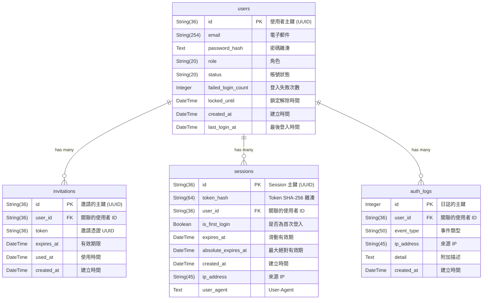

# 帳號資料庫 Schema 說明文件 (Auth DB)

本文件詳細說明外部連結檢查爬蟲 (`ext-link-checker`) 中負責帳號與權限管理的 Auth DB 資料庫結構。系統透過 SQLAlchemy ORM 進行資料庫操作。

資料庫預設路徑：`db/auth.db`

---

## 實體關聯圖 (ER Diagram)

---

## 資料表詳細說明

### 1. `users` (使用者帳號表)
此資料表記錄使用者的基本資訊與帳號狀態。

| 欄位名稱 | 型別 | 限制/預設值 | 說明 |
| :--- | :--- | :--- | :--- |
| `id` | `String(36)` | **Primary Key** | 使用者的主鍵，UUID v4 字串。 |
| `email` | `String(254)` | `UNIQUE`, `NOT NULL` | 使用者電子郵件（唯一，作為登入帳號）。 |
| `password_hash` | `Text` | `Nullable` | bcrypt 雜湊後的密碼。首次登入設密前為 `NULL`。 |
| `role` | `String(20)` | `Default: 'user'` | 帳號角色，如 `user` 或 `admin`。 |
| `status` | `String(20)` | `Default: 'pending'` | 帳號狀態：`pending` / `active` / `suspended` / `expired`。 |
| `failed_login_count` | `Integer` | `Default: 0` | 連續登入失敗次數（用於帳號鎖定防護）。 |
| `locked_until` | `DateTime` | `Nullable` | 帳號鎖定解除時間（`NULL` 代表未鎖定）。 |
| `created_at` | `DateTime` | `Default: 當下 UTC 時間` | 帳號建立的 UTC 時間戳記。 |
| `last_login_at` | `DateTime` | `Nullable` | 最後一次成功登入的 UTC 時間戳記。 |

### 2. `invitations` (邀請憑證表)
此資料表記錄系統發送給受邀者的一次性邀請連結與憑證。

| 欄位名稱 | 型別 | 限制/預設值 | 說明 |
| :--- | :--- | :--- | :--- |
| `id` | `String(36)` | **Primary Key** | 邀請紀錄的主鍵，UUID v4 字串。 |
| `user_id` | `String(36)` | **Foreign Key**, `NOT NULL` | 關聯的受邀使用者 ID (`users.id`)。 |
| `token` | `String(36)` | `UNIQUE`, `NOT NULL` | 邀請 UUID 憑證（單次使用）。 |
| `expires_at` | `DateTime` | `NOT NULL` | 此邀請連結的有效期限。 |
| `used_at` | `DateTime` | `Nullable` | 憑證被使用的時間（`NULL` 代表尚未使用）。 |
| `created_at` | `DateTime` | `Default: 當下 UTC 時間` | 邀請建立的 UTC 時間戳記。 |

#### 索引資訊 (Indexes)
* **`uq_invitations_token`**: `(token)` 唯一約束。
* **`ix_invitations_user_id`**: `(user_id)` 用於快速查詢使用者的邀請紀錄。

### 3. `sessions` (連線 Session 表)
此資料表儲存有效登入者的 Session 資訊。為防範資料庫外洩，Token 僅儲存其 SHA-256 雜湊值。

| 欄位名稱 | 型別 | 限制/預設值 | 說明 |
| :--- | :--- | :--- | :--- |
| `id` | `String(36)` | **Primary Key** | Session 的主鍵，UUID v4 字串。 |
| `token_hash` | `String(64)` | `UNIQUE`, `NOT NULL` | Session Token 的 SHA-256 雜湊值。 |
| `user_id` | `String(36)` | **Foreign Key**, `NOT NULL` | 關聯的使用者 ID (`users.id`)。 |
| `is_first_login` | `Boolean` | `Default: False` | 標記是否為首次登入的暫態 Session（設密完成前為 True）。 |
| `expires_at` | `DateTime` | `NOT NULL` | 滑動有效期（每次有效請求後重置）。 |
| `absolute_expires_at` | `DateTime` | `NOT NULL` | 最大絕對有效期（不受滑動影響，到達後強制登出）。 |
| `created_at` | `DateTime` | `Default: 當下 UTC 時間` | Session 建立時間。 |
| `ip_address` | `String(45)` | `Nullable` | 建立 Session 時的客戶端來源 IP 位址。 |
| `user_agent` | `Text` | `Nullable` | 建立 Session 時的瀏覽器 User-Agent 資訊。 |

#### 索引資訊 (Indexes)
* **`uq_sessions_token_hash`**: `(token_hash)` 唯一約束。
* **`ix_sessions_user_id`**: `(user_id)` 支援同一帳號多裝置登入管理。

### 4. `auth_logs` (身分驗證日誌表)
記錄系統中與身分驗證相關的所有重大安全性事件，作為後續安全稽核的依據。

| 欄位名稱 | 型別 | 限制/預設值 | 說明 |
| :--- | :--- | :--- | :--- |
| `id` | `Integer` | **Primary Key**, `Auto-Increment` | 日誌的主鍵。 |
| `user_id` | `String(36)` | **Foreign Key**, `Nullable` | 關聯的使用者 ID（部分事件可能無法確定使用者）。 |
| `event_type` | `String(50)` | `NOT NULL` | 事件類型：`login_success`, `login_failed`, `logout`, `locked`, `password_set`, `password_changed`, `invitation_sent` 等。 |
| `ip_address` | `String(45)` | `Nullable` | 事件發生時的客戶端來源 IP 位址。 |
| `detail` | `Text` | `Nullable` | 附加描述資訊（如登入失敗原因或細節）。 |
| `created_at` | `DateTime` | `Default: 當下 UTC 時間` | 事件發生的 UTC 時間戳記。 |

#### 索引資訊 (Indexes)
* **`ix_auth_logs_user_id`**: `(user_id)` 快速查詢單一使用者的所有事件。
* **`ix_auth_logs_created_at`**: `(created_at)` 快速依照時間區段篩選系統日誌。
